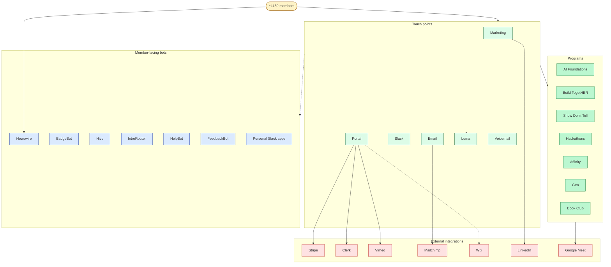

# Deep Dive: Member Surface

**Pass 1 v3 had a 6-node diagram for member surface. Reality is ~10× bigger.** This doc catalogs what members actually touch.

---

## Major paradigm-4 surface I'd missed: **14 Vercel Cron Jobs inside `wdai-foundation-platform`**

Configured in `web/vercel.json`. These run on **Vercel's cron infrastructure**, not GitHub Actions — a distinct sub-paradigm. They call platform API routes on schedule:

| Cron job | Schedule | Purpose |
|----------|----------|---------|
| `heartbeat` | every 12h | Cache health probe |
| `refresh-events` | daily 2am UTC | Pull Luma events into `CachedEvent` |
| `sync-stripe` | daily 3am UTC | Reconcile Stripe ↔ DB |
| `sync-slack-links` | daily 3:30am UTC | Map Slack users to platform users |
| **`sync-guests`** | **3× daily** (13:00, 19:00, 00:00 UTC) | Auto-approve Luma guests against member list |
| `check-cache-health` | every 6h | Validate cache invalidation |
| `collect-recordings` | daily midnight UTC | Pull Google Meet recordings |
| `process-uploads` | every 2h, hours 1-23 | Upload Vimeo videos, generate thumbnails |
| `daily-digest` | daily 8am UTC | **Posts cron-health summary to `#devops-website-alerts`** (the AdminBot alert channel — self-monitoring!) |
| `weekly-events-digest` | Monday 12pm UTC | Member-facing weekly events email |
| `weekly-stats` | Monday 2pm UTC | Pattern's weekly metrics report data prep |
| `weekly-trend-digest` | Friday 12pm UTC | Trend analysis email |

**This changes the paradigm 4 count.** WDAI has BOTH:
- **External GH Actions cron**: `wdai-marketing` calendar sync, `course-update-agent`, `website-content-agent`, `wdai-admin weekly-stats`, Madina's `promote.yml` + `discuss.yml`
- **Internal Vercel Cron Jobs** (inside the platform): the 14 above

That's **20+ scheduled automations** in total, not the 5 I had in Pass 1.

The `daily-digest` cron self-monitors all the others — queries `audit_log` for `cron.*` entries, groups by expected run count, posts healthy/warning/missing categories to `#devops-website-alerts`. **This is the "observability for federation" reference pattern.** Worth lifting verbatim.

---

## Member route topology (all routes members can hit)

### Marketing site (logged out)
- `/` home — homepage leaders, mission
- `/about` — story
- `/membership` — what's included
- `/pricing` — Monthly $10, Annual $100, Donor $300
- `/member-stories`
- `/our-leaders` — leader directory (public)
- `/story`
- `/privacy`, `/terms`

### Authenticated portal `/app/(app)/`
- `/dashboard` — member home
- `/welcome` — onboarding flow
- `/courses` — AI Foundations enrollment + lesson viewer
- `/events` — Luma-synced event listings + RSVP
- `/resources` — community resource library (members submit, save, share)
- `/directory` — member directory with profiles
- `/leaders` — leader directory + **BrandedAssetGeneratorForm** (leaders generate WDAI-branded social assets)
- `/slack` — Slack integration / member ↔ Slack user mapping
- `/checkout` — Stripe portal redirect
- `/admin` — staff only

### Member-facing API surface
- `/api/consent` — UserConsent records
- `/api/courses/[courseId]` + `/api/enrollments` — course progress
- `/api/intro/suggest-matches` — Madina's PR #603, intro matcher
- `/api/luma/rsvp`, `rsvps`, `events`, `createEvent`, `sync-status` — event interactions
- `/api/member-directory/members`, `/profile` — directory + own profile edit
- `/api/membership/status`
- `/api/resources` + `/[id]` + `/reorder` — resource CRUD
- `/api/slack/events`, `/track-click`
- `/api/stripe/create-checkout-session`, `/create-portal-session`, `/webhook`
- `/api/subscription/cancel`, `/change-plan`, `/invoices`, `/uncancel`
- `/api/user/onboarding-skip`

---

## Prisma entities tied to member experience

22 models in `prisma/schema.prisma`. Member-facing ones:

| Entity | What it captures |
|--------|------------------|
| `User` | Core user record (Clerk-linked) |
| `Membership` | Subscription tier, status, period |
| `UserConsent` | Privacy/data consent toggles |
| `Resource` + `ResourceSave` | Community library + per-user saves |
| `EventRsvp` + `CachedEvent` + `EventMeeting` | Luma sync + member RSVPs |
| `CohortRsvp` | Cohort-specific opt-in (separate from events) |
| `CourseEnrollment` + `LessonContent` + `LessonProgress` | Course state |
| `SavedPrompt` | **Members save their own AI prompts** — bigger feature than I knew |
| `Announcement` | Member-facing banner (the no-deploy banner system Madina built Feb 13) |
| `Slack` | Slack user ↔ platform user mapping |
| `RecordingUpload` | Live session recordings + member access |
| `LegacyApprovedEmail` | The ~700-member Airtable migration holdover |
| `ContentChangeBatch` + `ContentChangeProposal` | `course-update-agent`'s autonomous PR output |
| `AuditLog` | Cron health, user actions, system events (queried by `daily-digest`) |

---

## Programs (every cohort + event type members can join)

| Program | Cadence | Lessons / Sessions | Bot/automation |
|---------|---------|--------------------|----------------|
| **AI Foundations Basics** | Monthly cohort | 15 lessons / 3 weeks (M-F) + 6 live (M/Th) | `mailchimp-cc /new-basics` skill, `aifoundations1-basics` channel |
| **AI Foundations Intermediate** | Monthly cohort | 10 lessons / 2 weeks + 4 live (M/Th) | `/new-intermediate`, `aifoundations2-intermediate` channel |
| **AI Foundations Advanced** | Monthly cohort | 15 lessons / 3 weeks + 9 live (M/W/F) | `/new-advanced`, `aifoundations3-advanced` channel |
| **Build TogetHER** | Monthly | Hands-on lunch-and-learn | `programs-buildtogether` channel, `wdai-hive` bot |
| **Show Don't Tell** | Monthly | Live speaker session | `programs-showdonttell` channel |
| **Guest Interviews** | Ad-hoc | Speaker series | `programs-ai-guest-interviews` channel |
| **AI Podcast** | Ad-hoc | Podcast recording sessions | `programs-ai-podcast` channel |
| **Speed Networking** | Pilot | Member-to-member matching | `speed-networking-pilot` channel |
| **UK Hackathon** | Annual | Multi-team build event | 5+ `uk-hackathon-*` channels |
| **Bolt Hackathon** | Annual | Sponsored hackathon w/ Bolt | 8+ `boltteam-*` and `bolt-hack-*` channels |
| **AI-Powered Women Conf** | Sept 2025 | In-person MIT conference | `ai-powered-women-conf-2025` channel |
| **Book Club** | Bi-weekly | Currently reading "AI Engineering" | `book-club` channel (107 members) |
| **SuperMoms** | Affinity group | Ongoing | `supermoms` channel (167 members) |
| **Women Slackers** | Affinity group | Ongoing | `women-slackers` channel |
| **Solopreneurs / Consultants** | Affinity group | Ongoing | `topic-solopreneurs` (58 members) |
| **Job Search Support** | Ongoing | Member-to-member | `job-search-support` channel (398 members) |
| **Geographic chapters** | Per city | In-person meetups, monthly varies | 17+ `geo-*` channels |

**The geo chapter pattern is non-trivial.** Some have leads (NYC has 4: `<@U07S16PJGP6> <@U08EDJ3G5E0> <@U09MCKKJ2AE> <@U08R2785H9T>`). Some are dormant. Some run monthly dinners (`sf-east-bay-dining-group` is an accountability cohort).

---

## Email touchpoints (everything Mailchimp can send a member)

Via `mailchimp-cc` campaigns:
- **Pre-kickoff emails** (2 per cohort, before course start)
- **Daily lesson emails** (15 for Basics, 10 for Intermediate, 15 for Advanced)
- **Recap emails** (add recording + transcript links after each live session)
- **Pre/post cohort surveys** (Brigitte added Apr 27)
- **Newsletter** mid-month + end-of-month (`gtmops-newsletter` channel coordinates)
- **One-off announcements**

Via platform crons:
- **Weekly events digest** (Monday 12pm UTC — `weekly-events-digest`)
- **Weekly trend digest** (Friday 12pm UTC — `weekly-trend-digest`)

Via WixSync (legacy):
- **Welcome series** when Wix → Mailchimp old signup flow fires

---

## External integrations the member sees

| Integration | What member sees | Status |
|-------------|------------------|--------|
| **Stripe** | Checkout, cancel, change plan, invoices | Live |
| **Clerk** | Login, auth | Live |
| **Luma** | Event registration page, calendar invite | Live (members register on luma.com URLs, then RSVP synced to platform) |
| **Vimeo** | Course video player, recap recordings | Live |
| **Google Calendar** | Subscribe-able cohort calendar (generated per cohort) | Live |
| **Mailchimp** | Every email | Live |
| **Slack** | Community workspace | Live (member adds Slack identity in `/slack` portal page) |
| **Wix** | Legacy portal | **Deprecating** — ~700 members still on Wix-flow until August |
| **LinkedIn** | WDAI org page posts (Marketing pillar publishes here via `wdai-marketing` LinkedIn UGC client) | Live |
| **Google Meet** | Live cohort sessions | Live (recordings auto-collected via `collect-recordings` cron + Wit agent's Meet→Vimeo EOD pipeline) |
| **Twilio** | Voicemail line `+1 (833) 605-7130` | Live (transcripts → Gumloop → `#devops-twilio-alerts`) |

---

## Member-facing bots (richer than Pass 1 v3)

| Bot | Channel | What it does |
|-----|---------|--------------|
| **WDAI Newswire** | `#intros` | Welcomes new members ("Welcome to the community, X!") |
| **BadgeBot** | various cohort channels | Badge tracking MVP (Avril, Ruta, Vaishali built) |
| **wdai-hive** | `#programs-buildtogether` (targeted via `TARGET_CHANNEL_ID=C088PDC4VRS` in env) | "Did you play with AI this week?" weekly DM check-ins |
| **Gumloop intro matcher** | `#intros` (or DM) | Member intro routing (being replaced by `/api/intro/suggest-matches`) |
| **Gumloop get-help bot** | `#get-help` | Member support routing |
| **Gumloop website-feedback router** | `#website-feedback` | First-message-in-channel → ticket creation |
| **AdminBot** | `#devops-admin-mgmt` | NOT member-facing — alerts staff when new Slack joiner has no Wix purchase |
| **Lumabot** | various | `/luma-create-event` slash command for staff |
| **Personal member-built Slack apps** | varies | Akshita's Assistant, Anennya, Maninder, Simi, Carolyn — members ship their own bots |
| **Polly** | various | Poll bot for time voting on event scheduling |

---

## Customer support intake (member → staff)

Three email aliases route to `#ops-customer-support-emails` (private, 2 members):
- **billing@** — Stripe / refund related
- **help@** — General support, website fixes, access issues
- **info@** — General inquiries, spam

Plus:
- `#get-help` channel (1072 members) — member-to-member + staff support
- `#website-feedback` channel (32 members) — direct product feedback (Gumloop-routed to tickets)
- `#new-member-troubleshooting` — onboarding issue triage
- Voicemail line transcribed to `#devops-twilio-alerts` (e.g., cancellation requests members can't complete online)

---

## External partner channels (members in joint programs)

| Channel | Partner | Members |
|---------|---------|---------|
| `ext-perplexity-wdai` | Perplexity | 12 |
| `ext-plus-one-beta` | Plus One | 111 |
| `ext-bolt-wdai-partnership` | Bolt | 3 |
| `ext-wdai-charter` | Charter | 4 |

Plus the Bolt hackathon team channels and UK hackathon channels are partner-adjacent.

---

## Revised Diagram 1e — full member surface

**Touch points** (what members see): Marketing site · Portal · Slack workspace (110+ channels) · Mailchimp emails · Luma · Twilio voicemail.

**Programs** (what they participate in): AI Foundations (Basics/Intermediate/Advanced cohorts) · Build TogetHER (monthly) · Show Don't Tell (monthly) · UK + Bolt Hackathons · Affinity groups (SuperMoms, Solopreneurs, Women Slackers) · 17+ Geo chapters · Book Club.

**Bots** (community-facing): Newswire (welcome) · BadgeBot · wdai-hive (engagement) · Gumloop intro router · Gumloop get-help · Gumloop feedback router · personal Slack apps (Akshita / Anennya / Maninder / Simi / Carolyn).

**External integrations**: Stripe (payments) · Clerk (auth) · Vimeo (videos) · Mailchimp (email) · Wix (legacy, ~700 members) · LinkedIn (WDAI page) · Google Meet (live sessions).

---

## Patterns observed (deferred to Pass 3 for design decisions)

1. **Paradigm 4 has two sub-flavors**: GitHub Actions cron AND Vercel Cron Jobs. Different infrastructure, same paradigm. Spec should name them distinctly.
2. **`daily-digest` self-monitoring cron is the observability reference**. It queries audit_log, categorizes other crons as healthy/warning/missing, posts to a known Slack channel. The team-OS dashboard layer (Pass 3) can use the same pattern.
3. **The "member-facing surface" is far larger than I thought** — 6 nodes → 30+ nodes. Federation must be careful to NOT touch the member surface unless deliberately. The team-OS is internal infrastructure; if it leaks into member experience, that's a bug.
4. **Affinity groups + geo chapters are member-led infrastructure.** Each has its own informal ownership (NYC chapter has 4 leads). The team-OS shouldn't try to centralize these; they live in Slack and that's correct.
5. **Wix migration is a real cross-cutting risk.** ~700 members still on Wix flow. WixSync in `wdai-admin` parallel-runs with the new Stripe flow. The migration cutover affects: WixSync deprecation, AdminBot's "no Wix purchase" warnings, Mailchimp welcome series, Airtable LegacyApprovedEmail table, and likely Lumabot's Airtable-based guest approval. **The team-OS should NOT try to own this migration** — it's a platform-team responsibility. But the team-OS should reflect it as a known constraint.
6. **SavedPrompt entity** — members save their own AI prompts. Worth noting as a potential team-OS adjacency (members could share prompts; the platform could surface community-best-prompts). Out of scope for Pass 1.
7. **AuditLog as the cross-paradigm telemetry source** — both Vercel crons and the daily-digest cron use it. The team-OS could write team-OS events into AuditLog too, gaining the same dashboard.

---

## What I should have caught earlier but didn't

1. **20+ scheduled automations, not 5.** Big undercount.
2. **Vercel Cron Jobs are a distinct sub-paradigm** under paradigm 4. Worth a row in the paradigm table.
3. **Member-built Slack apps** are a parallel member-facing bot tier I'd lumped with member chatter. Akshita's Assistant, Anennya's, Maninder's, Simi's, Carolyn's all exist and are member-owned.
4. **Self-monitoring observability cron** (`daily-digest`) exists and posts to alerts channel. This is mature infra discipline.
5. **`ContentChangeBatch` + `ContentChangeProposal` entities** are how `course-update-agent` stores its autonomous proposals. The PR-as-approval-gate has a DB tier too.
6. **`Announcement` entity** is the no-deploy banner system Madina built Feb 13. Member-facing, staff-controlled.
7. **External partner channels exist as a fourth member tier** — beyond core/leaders/volunteers, there's `ext-*` where partner companies have direct access to WDAI members.

---

## Open questions for member surface

1. **Does the team-OS need a "member-surface impact assessment" gate** for any change that might touch members? Member-facing changes have higher blast radius than internal-only changes.
2. **Wix migration timeline** — when does WixSync get deprecated? When does AdminBot's "no Wix purchase" warning go away? When does Lumabot need to switch from Airtable to Supabase for member lookup?
3. **Member-built personal Slack apps** — are they considered part of the WDAI ecosystem, or member-personal? Federation impact differs.
4. **Geographic chapters** — should chapter leads have their own pillar in the team-OS? They have a real ops surface (event scheduling, in-person meetups, regional comms).
5. **Affinity groups (SuperMoms, Solopreneurs, etc.)** — same question. Member-led but with light staff support.
