# WDAI Operational System Context — Pass 1 v6

> **Status:** Last probe 2026-05-12 · Confidence: **high for code-of-record claims**, medium for inferred behavioral claims, see `_pressure-test.md` for full tier breakdown.

**C4-disciplined rebuild.** Diagrams obey strict levels (L1 Context → L2 Container → L3 Component). Node labels carry name only; meaning lives in color (classDef) and edge style. Every diagram earns its keep by serving one of the seven Pass-3 design questions named below.

## Table of contents

- [What Pass 1 is for](#what-pass-1-is-for)
- [Sibling files in this Pass 1 set](#sibling-files-in-this-pass-1-set)
- [The seven Pass-3 design questions](#the-seven-pass-3-design-questions)
- [Problem statement](#problem-statement)
- [Guiding principles](#guiding-principles-validated-by-audit-kept-verbatim-from-v4)
- [Edge style legend](#edge-style-legend)
- **C4 levels**
  - [L1 — System Context](#l1--system-context)
  - [L2 — Container](#l2--container)
  - [L3a — Inside `wdai-foundation-platform`](#l3a--inside-wdai-foundation-platform)
  - [L3b — Inside the two OpenClaw stacks](#l3b--inside-the-two-openclaw-stacks)
- [Cross-cutting views](#cross-cutting-views)
- [Audit gaps](#audit-gaps--what-i-deliberately-havent-looked-at-10)
- [Findings table (32 observations)](#findings-table-32-observations-each-tagged-with-the-pass-3-question-it-serves)
- [Open questions](#open-questions-pass-1-factual-gaps)
- [Source deep-dives](#source-deep-dives)

---

## What Pass 1 is for

Pass 1 documents WDAI's **current state as a question-surface for Pass 3**.

This is **not** inventory. It is not a catalog of every bot, channel, or repo. The deep-dives carry inventory — they are linked at the end. Pass 1's job is to surface, with evidence, the operational shape that Pass 3's federation design must answer to.

**Important framing:** "team-OS" throughout this document refers to a **proposed future federation** that Pass 3 will design. **It does not exist today.** When this document says "Pass 3's federation must X," it means "if/when Pass 3 designs a federation, X is a constraint surfaced by current state." Pass 1 does not assume team-OS exists or has obligations.

**Pass 1 is NOT:**
- Recommendations, proposals, or "team-OS should X" claims (Pass 3's job)
- A coordination-surface map (Pass 2's job)
- An exhaustive bot or member-surface inventory (deep-dive docs)

**Pass 1 IS:**
- The observable system today
- The seven design questions Pass 3 must answer (if a federation is designed at all)
- The evidence (observations + diagrams) that frames those questions

If you can't trace a claim here to a deep-dive or named source, it doesn't belong.

## Sibling files in this Pass 1 set

This file is the entry point. Subsections that grew too large to fit in one document are split into siblings, all in the `pass-1/` folder.

| File | Scope |
|------|-------|
| `00-readme.md` | Index and reading order |
| **`01-system-context.md`** (this file) | Framing · 7 Pass-3 questions · C4 levels (L1-L3) · cross-cutting structural views · conventions · findings · open questions · audit gaps |
| `02-process-flows.md` | 12 sequence diagrams + 1 journey: member-facing + ops-facing + agent flows |
| `03-operational-architecture.md` | Deployment topology · SLA / criticality tiers · on-call · external integration risk register |
| `04-data-architecture.md` | Data flow / data residency · Prisma ER |
| `05-people-and-process.md` | Persona tooling map · stakeholder expectations matrix |

The original `design/team-os/01-system-context.md` is preserved as `_archive-v6-monolithic.md` for reference.

---

---

## The seven Pass-3 design questions

Every diagram and observation in Pass 1 connects to one of these. Pass 3 must produce answers; Pass 1 must produce evidence.

| # | Question | One-line framing |
|---|----------|------------------|
| **Q1** | Where does the team-OS live? | Helen's doc says Cowork; reality has paradigm 2 retreating into paradigm 4; Madina's direction is GitHub Actions. |
| **Q2** | How do agents propose, humans approve? | `course-update-agent`, `website-content-agent`, marketing `/approve-plan` already ship the pattern. |
| **Q3** | How do we observe what's running? | Platform's `AuditLog` + `daily-digest` is the existing self-monitoring primitive. |
| **Q4** | How do we onboard non-engineers? | Sheena is zero-state today; `mailchimp-cc`'s tiered runbooks → skills → source code is the working reference. |
| **Q5** | How do we coordinate cross-repo migrations? | Airtable → Supabase will break Lumabot's guest approval unless coordinated; silent cross-repo dependency. |
| **Q6** | How do we ingest per-user Granola → shared wiki? | Each Granola account is private; multi-attendee meetings produce duplicate transcripts needing dedup. |
| **Q7** | How does identity/auth federate? | CODEOWNERS only in platform; three Slack tokens; Gumloop is single-user-many-flows internally anonymous. |

---

## Problem statement

WDAI's institutional knowledge and operational tooling live in scattered, owner-specific spaces (Helen's head + Helen's agents + Madina's agents + per-pillar Google Docs + per-volunteer Gumloop flows). The org is approaching a knowledge bottleneck where Helen is the only integration point, and volunteer churn risks taking institutional context with them.

**Named in `#team-core` by Madina, Apr 14:** *"need an environment where tools made for your pillar lives in our ops space or provide visibility into where they live… need to think future proofing… that person stops volunteering tomorrow and take their tools with them."*

## Guiding principles (validated by audit, kept verbatim from v4)

1. **Federated capture over centralized scraping.** Each member's local agent captures their own context.
2. **Curated insight over raw volume.** Drive = artifact layer. Shared repo = insight layer. Peers, not duplicates.
3. **Activation energy near zero.** >15 min/week per person = the system dies.
4. **One source of truth per concept.** Conflicts resolved by a consolidation layer, not human copy-paste.
5. **Agents propose; humans approve.** Both monthly code-modifying agents in `wdai-foundation-platform` and the marketing-content-calendar bot enforce this via PR-as-the-gate.
6. **Tiered access matching real habits.** Core leadership on GitHub. Volunteers on Drive. The architecture bridges.
7. **Agents provisioned as employees.** Own machine (or isolated environment), own logins, own credentials, own password manager. Helen's Mac mini setup is the verified reference.

---

## Edge style legend

All diagrams use these four arrow forms (Mermaid native — no custom edge styling that won't render).

| Arrow | Meaning |
|-------|---------|
| `-->` solid | Live runtime dependency, one direction |
| `-.->` dotted | Legacy / drift / occasional / proposed |
| `==>` thick | Migration in flight, or critical-path dependency |
| `<-->` bi-directional | Events / data flow both ways |

Edge **labels** carry the specific verb ("approves", "drains into", "WILL BREAK"). Nodes carry only names.

---

## L1 — System Context

**Serves Q1** (boundary of the team-OS surface) and **Q7** (who has access to cross the boundary).

WDAI Operational Surface = one system from the outside. Persons interact with it. External SaaS systems are spoken to by it. The boundary is what Pass 3 must federate; everything inside is L2's problem.

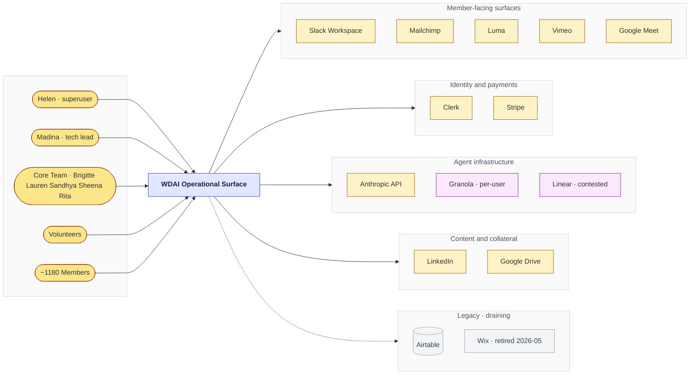

**What this reveals (Q1, Q7):**
- **Five distinct person-classes** cross the boundary. Each has different tooling habits (GitHub for core; Drive for volunteers; Slack/Luma/Mailchimp for members). Pass 3's federation contract must serve all five — not just GitHub-literate users.
- **Airtable is the only legacy external** (dotted gray). Every other external is current. A Pass 3 federation would not need to design *around* Airtable; the platform is already retiring it (see L2).
- **Anthropic API is an external like any other** — used by `course-update-agent`, `website-content-agent`, `wdai-marketing`'s `copy-generator.ts`, and every OpenClaw agent. Cost and rate-limit federation is a Pass 3 question (`Q7`).
- **Linear and Granola are CONTESTED externals** (dotted purple). Both exist, both are used today, both have a Pass-3 design question attached:
  - **Linear** — Helen uses it for "long-living build related things" (Feb 4 quote) and has MCP connected to Claude Code; `wdai-foundation-platform/CLAUDE.md` references Linear ticket prefix `WDA-285`. **Madina proposed May 9 making Linear the central source-of-truth for all team work** — that proposal is not yet accepted. The contested label captures: today Linear is partial scope; Pass 3 must decide whether to expand it.
  - **Granola** — per-user accounts (Helen's, Madina's) feed each agent's enrichment pipeline. The Q6 dedup problem lives here. See `04-data-architecture.md` and `02-process-flows.md` for the Atlas → Polaris pipeline.

The **inside** of `WDAI Operational Surface` is unpacked in L2.

---

## L2 — Container

**Serves Q1** (which runtime hosts what), **Q5** (cross-repo migration hazards), and partially **Q2** (where the propose/approve patterns live).

Each container is a deployable unit. Repos that are not deployable units (skills reference repo, Perplexity-eval notes) are not on this diagram — see the findings table.

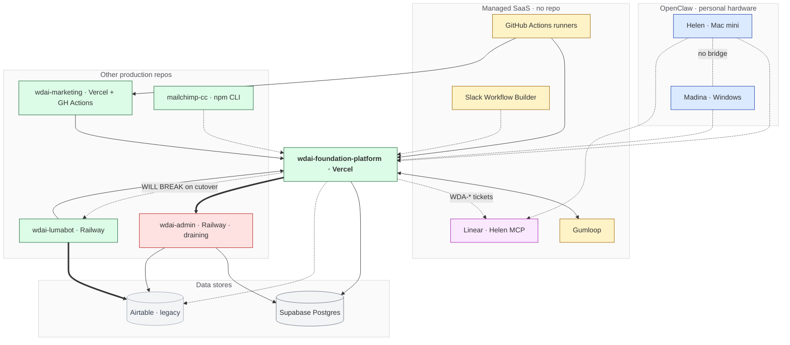

**What this reveals:**

**Q1 — runtime tension.** Five live containers run on three runtimes (Vercel, Railway, npm-CLI/local). Two OpenClaw stacks run on personal hardware. SaaS layers (Gumloop, Slack Workflow Builder, Linear) host work that doesn't have a repo at all. A Pass 3 federation can't pick a single runtime without orphaning a container — the question is which runtime hosts the *federation contract*, not which runtime hosts everything.

**Linear (contested · purple)** — sits in the SaaS tier today. Helen MCP-connected (Feb 4). `wdai-foundation-platform/CLAUDE.md` references Linear tickets inline (`WDA-285` for deferred PPR/cacheComponents work). **Madina proposed May 9 making it the central source-of-truth for ALL team work.** That proposal would change Linear from "Helen's tech tracker" to "federation backbone." Pass 3 must decide. See `05-people-and-process.md` for who has Linear access today.

**Q5 — three migration hazards visible as edges:**

1. **Platform ==> Admin** (thick): `wdai-admin` is being drained into the platform. Verbatim header in `slack-admin.ts`: *"This replaces the Railway internal webhook relay — notifications are now sent directly from Vercel instead of routing through Railway's MemberBot service."*
2. **Lumabot ==> AirtableDB** (thick): Lumabot reads Airtable as silent source-of-truth for guest approval. The platform's Airtable → Supabase migration (paused until August, finding #16) will break this if not coordinated.
3. **Platform -.-> Lumabot "WILL BREAK on cutover"**: explicit dependency hazard, not currently wired but inevitable on cutover.

**Q2 — propose/approve patterns already running.** GitHub Actions runners drive two production code-modifying agents inside the platform (`course-update-agent` 1st of month, `website-content-agent` 15th) plus the `wdai-marketing` calendar-sync cron (PAUSED since 2026-04-21 — finding #10). All three open PRs as the approval gate. The marketing container additionally has a `/approve-plan` browser UI for the plan-level approval — a deliberate Phase-8 move *away* from Slack-button approval. Pass 3's "agents propose / humans approve" question has running references; the design question is which is the canonical pattern.

**Two OpenClaw stacks with no bridge.** Helen's Mac mini and Madina's Windows machine both connect to the platform (dotted — opportunistic, not infrastructural) but have no peer connection to each other. This is the federation gap most central to Q1 and is unpacked in L3b.

**Containers NOT on this diagram (deliberately):**
- `claude-code-skills` (public skills reference, no live deps)
- `perplex_computer` (Helen's stalled Perplexity Computer eval, no traffic)
- `weekly-wdai-report` (GitHub Pages report sink, downstream of Pattern's OpenClaw — appears in L3b)

---

## L3a — Inside `wdai-foundation-platform`

**Serves Q3** (observability) and **Q7** (identity/auth federation).

The platform is the highest-traffic container and the only one with three independent Slack-bot identities living as code, plus the only one with self-monitoring. Pass 3's observability and identity questions both anchor here.

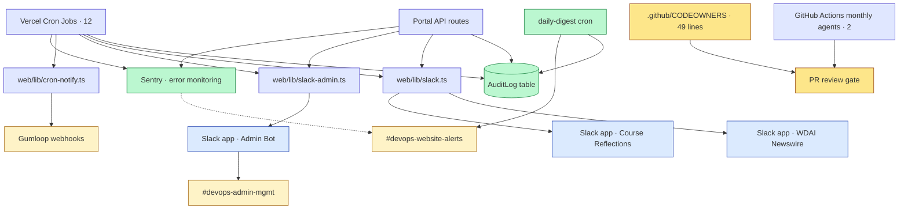

**What this reveals:**

**Q3 — observability is already federated through `AuditLog`.** Every Vercel cron run, every portal API action, and the daily-digest cron itself write to one table. `daily-digest` (8am UTC) queries the last 24h, groups by expected run count, posts a healthy/warning/missing summary to `#devops-website-alerts`. This is a working self-monitoring primitive. The Pass-3 question: *does the team-OS reuse `AuditLog` (cheap, existing) or build a separate event sink (expensive, fresher contract)?*

**Q7 — three Slack apps, three tokens, one repo.** The three apps live as TypeScript in `web/lib/slack*.ts`:

| Slack app | Token env | Source file | Posting functions |
|-----------|-----------|-------------|-------------------|
| **WDAI Newswire** | `SLACK_MEMBER_BOT_TOKEN` | `web/lib/slack.ts` | 10+ (profile intro, new event, weekly digest, alerts, etc.) |
| **Admin Bot** | `SLACK_ADMIN_BOT_TOKEN` | `web/lib/slack-admin.ts` | 6 (new member, churn, no-Wix-purchase, weekly stats, recording, upload fail) |
| **Course Reflections** | `SLACK_BOT_TOKEN` | `web/lib/slack.ts` (module webhooks) | reflection sharing per module |

The federation question is whether Pass 3's team-OS shares Newswire (less sprawl, mixed concerns) or stands up its own app (clean concerns, more tokens to rotate).

**`CODEOWNERS` exists only here** (49 lines). Other repos enforce reviewer-gating socially. The "agents propose, humans approve" Q2 pattern depends on a working PR gate — only the platform has the technical primitive in place.

**Gumloop is bidirectional.** `cron-notify.ts` posts cron lifecycle events to `GUMLOOP_CRON_WEBHOOK_URL`. Separate `GUMLOOP_WEBHOOK_URL` carries PR/content events. Pass 3 must treat Gumloop as a peer system, not a downstream consumer.

**Cron count clarification.** `web/vercel.json` enumerates **12 Vercel cron jobs** by the deep-dive `member-surface` count. The previous Pass 1 v4 claim of "14 Vercel crons" is unverified against the table provided in `deep-dive-member-surface.md`. Treated as a data conflict, flagged in Open Questions.

---

## L3b — Inside the two OpenClaw stacks

**Serves Q1** (where the team-OS runtime lives — paradigm 1 is one of the candidates) and **Q6** (Granola dedup).

Two parallel mature multi-agent setups exist on personal hardware. They have no shared layer, no peer messaging, and no shared Granola pipeline. Whether the team-OS treats this as a *bridge* problem or a *replace* problem is Pass 3's call.

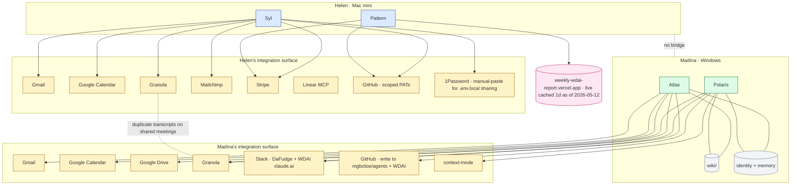

**What this reveals:**

**Q1 — paradigm 1 is real, mature, and unfederated.** Both stacks run multi-agent setups (5 agents total). Madina's stack has a shared wiki between Atlas and Polaris; Helen's stack has no equivalent shared layer between Syl, Pattern, and Wit. If Pass 3 picks paradigm 1 (Cowork or local) as the runtime, any federation design would need to work *between two physical machines on two operating systems*, not just inside one.

**Q6 — Granola is per-user by design.** Each Granola account captures only that user's audio. Meetings with both Helen and Madina present produce two transcripts that need dedup before either becomes canonical. Helen's Business plan ended 2026-04-07 (finding #25, exact post-Apr-7 status open — see Open Questions). The dedup problem is asserted from the per-user account model; it is **not yet observed in code** because no pipeline ingests both accounts today.

**Output writes that DO escape each stack.** Pattern publishes a weekly report (live at `weekly-wdai-report.vercel.app`). The Meet→Vimeo pipeline is **NOT** in Helen's OpenClaw stack — verified by probe sweep 2026-05-12, it runs as the platform Vercel cron `/api/cron/collect-recordings` (daily midnight UTC) + companion `/api/cron/process-uploads` (every 2hr). Earlier Pass 1 drafts attributed the pipeline to a "Wit" Helen-OpenClaw agent; the code lives in `web/app/api/cron/collect-recordings/route.ts`. The "Wit" name may persist as Helen's nickname for the cron pipeline, but it's not an OpenClaw agent.

So Helen's OpenClaw stack today is **Syl + Pattern** (verified). Pattern is the only one with a verified outward emission (the public report URL). Madina's stack has no equivalent outward write into a WDAI-shared space today.

**Integration surface (the new richer view above):** each agent isn't isolated to its wiki — it reaches across Gmail, Calendar, Drive, Granola, Slack, GitHub, plus a credential vault (password manager — exact tool unverified) and observability tools (context-mode for Polaris). The "no bridge" finding stands, but the bridge surface is broader than just wiki ↔ wiki: Pass 3 could conceivably federate at the Gmail layer (cross-account read), the Calendar layer (shared deduped agenda), or the Granola layer (cross-attendee dedup), not only at the wiki layer.

**The "no bridge" edge is the central federation question.** Pass 3 has to choose: build the bridge, replace both stacks with a shared runtime, or accept paradigm 1 as inherently personal and federate only the *outputs* (the way Pattern already does).

---

## Cross-cutting views

These don't fit cleanly into C4 L1/L2/L3 levels — they cut across the system. Each surfaces something the layered diagrams don't.

### Business capability map (mindmap)

What WDAI exists to do, mapped to the containers that deliver each capability.

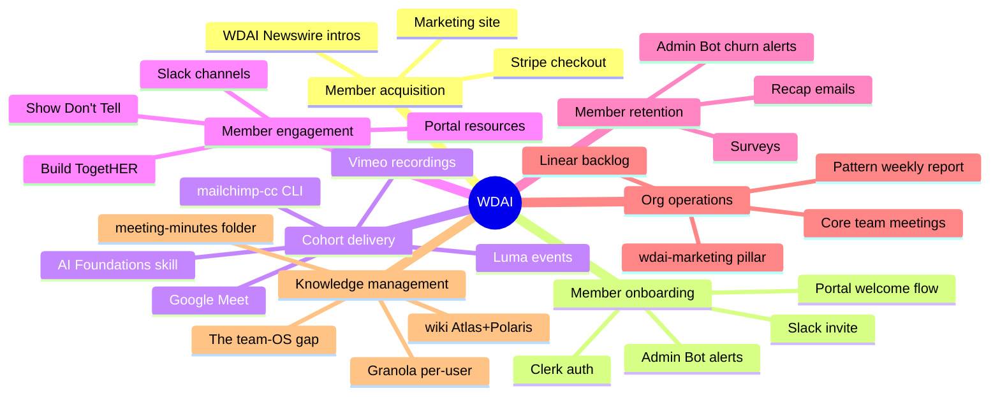

Pass 3's federation primarily addresses "Org operations" + "Knowledge management." The other five are member-facing and out of scope.

### Security / identity — tier structure

Public is the only true outermost. Member / Volunteer / Core are **parallel** siblings, not nested. Agents are *provisioned by* core members (employee-provisioning model — Helen provisioned Syl). The credential vault is **orthogonal** to the tiers, not a higher one — it serves everyone.

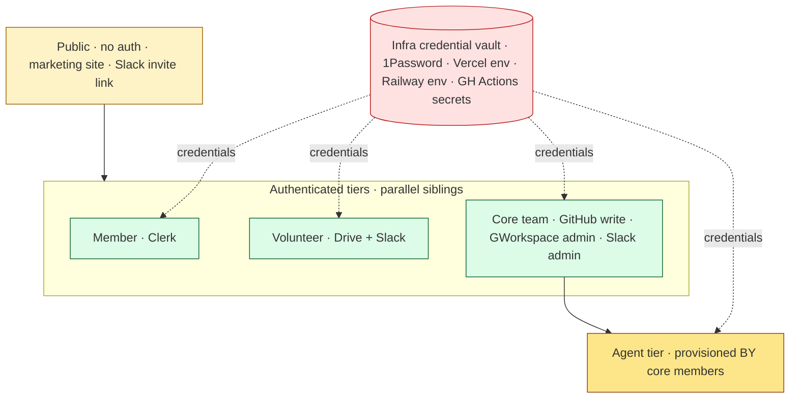

Five named tiers + a vault. The previous version implied strict nesting; reality is parallel siblings with a shared vault.

### Security / identity — credential inventory

The same picture again, but at the credential level. Token sprawl is the real Q7 question.

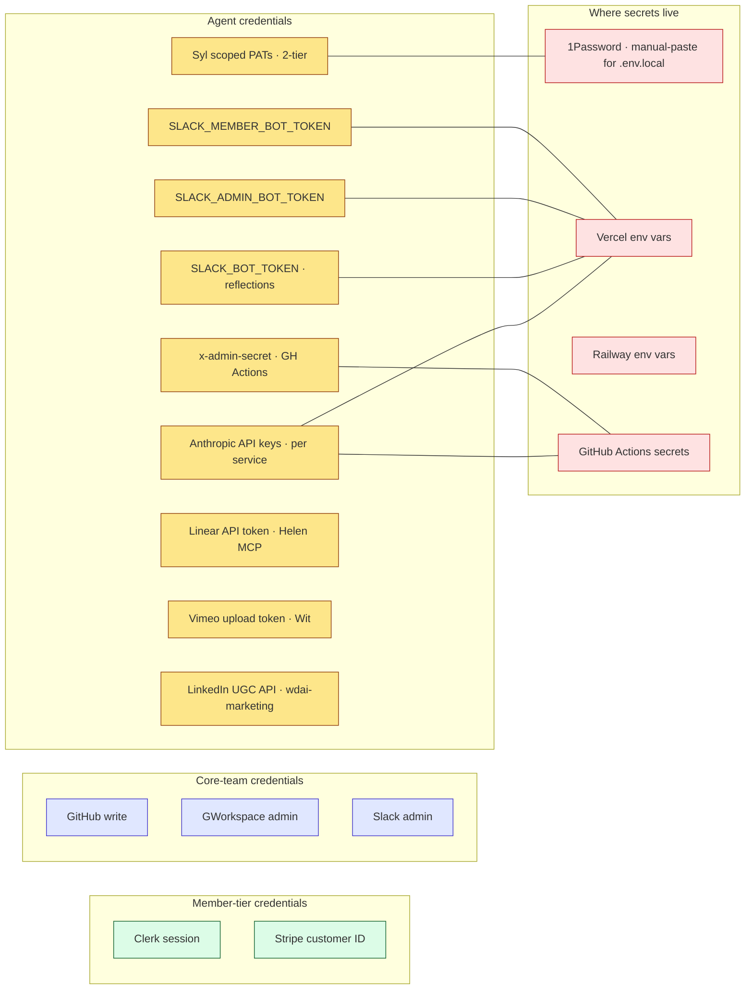

**What this surfaces:**
- **At least 9 distinct named credentials** floating around. Three separate Slack tokens (`SLACK_MEMBER_BOT_TOKEN`, `SLACK_ADMIN_BOT_TOKEN`, `SLACK_BOT_TOKEN`) = three separate Slack apps. Token sprawl is visible.
- **Anthropic API keys live in at least two different secret stores** (Vercel env for marketing + platform runtime; GH Actions secrets for the monthly autonomous agents + admin's `claude.yml` workflow). Rotation requires touching both — no unified procedure. (Railway env was previously claimed as a third store; not confirmed — neither `wdai-admin` runtime nor `wdai-lumabot` appears to use Anthropic.)
- **Syl uses a two-tier PAT model** (permissive scope on `mailchimp-cc`, fine-grained on `wdai-foundation-platform`). This is Helen's deliberate pattern from Mar 5.
- **`x-admin-secret` header for internal cron POSTs** is the cross-paradigm primitive (reused by Atlas's `promote.yml`, Polaris's `discuss.yml`, and `wdai-admin/weekly-stats.yml`).

Q7's "how does identity federate" is structurally a credential-rotation + scope-delegation problem, not a tier-membership problem.

### Paradigm constraint grid

Each paradigm by maintenance burden (rows) × reliability (columns).

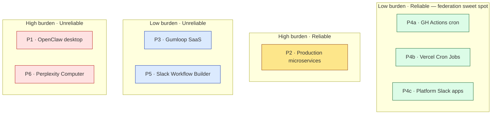

Top-left = the federation sweet spot (low maintenance, high reliability). Currently the P4 family lives there. P1 (Helen's preferred Cowork/OpenClaw direction) sits in the bottom-right per ongoing `#topic-openclaw` fatigue chatter. P3 (Gumloop) is internally anonymous and Helen-single-owned, so reliability is structurally constrained.

### Maturity grid

Each pattern by maturity (rows) × criticality (columns).

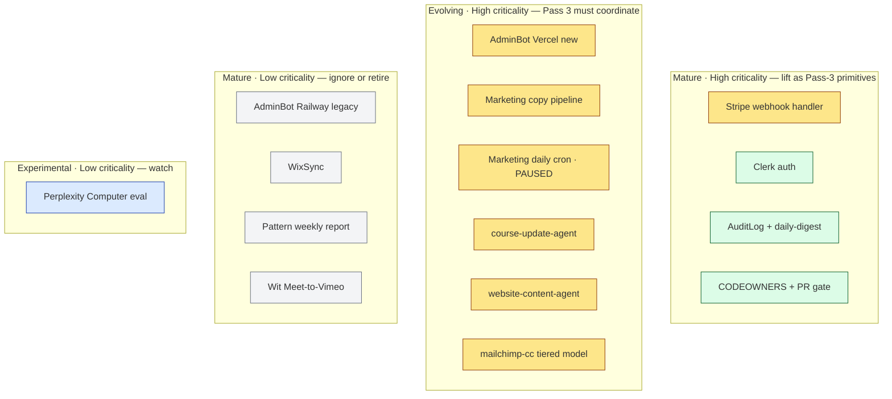

**Stripe webhook handler note:** reclassified from "battle-tested core" to "critical but evolving" — Helen Feb 23 documented "stripe webhooks are complex, in many ways our DB overengineered a bit on safety" plus a member-cancel bug that day. Still high-criticality but not yet "lift verbatim" stable.

**Top-left (green)** = battle-tested core. Pass 3 lifts these as primitives without rebuilding.
**Top-right (amber)** = critical but evolving. Pass 3 must coordinate, not assume stability.
**Bottom-left (gray)** = mature but low-stakes or retiring. Ignore or schedule removal.
**Bottom-right (blue)** = experimental. Watch, don't bet Pass 3 on them yet.

### Reference patterns (3 mini-architectures)

Each of these is a working primitive Pass 3 may generalize. Inline shape only — full detail in deep-dives.

**`wdai-marketing` vault structure** (federation prototype):

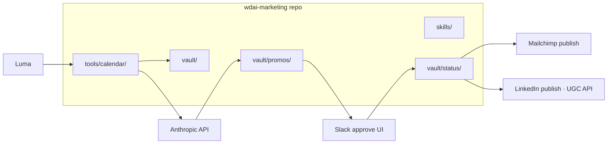

Vault = context layer (hand-curated). Promos + Status = operations layer (auto-generated, flat-file YAML). Two-touchpoint approval (plan, then copy).

**`mailchimp-cc` tiered onboarding** (Q4 reference):

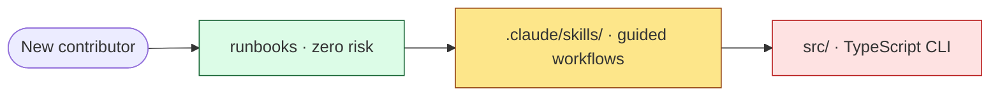

Three tiers of contributor risk. Green = first PR for anyone. Red = engineering review required.

**`wdai-admin` cron pattern** (Q3 reusable primitive):

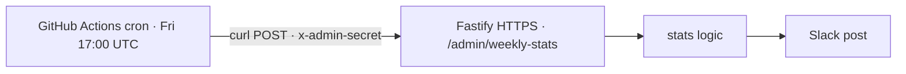

GH Actions cron + curl POST + shared secret header. Same pattern Atlas/Polaris use for `promote.yml` + `discuss.yml`. Reusable across services.

---

## Audit gaps — what I deliberately haven't looked at (#10)

Honest scope acknowledgment. These are knowable but I didn't audit.

**Inside `wdai-foundation-platform`:**
- `/api/admin/*` endpoint internals (12 admin routes — only the names are surfaced)
- Clerk webhook handler logic
- Stripe webhook handler logic (only mentioned at the verbatim header level)
- The full Vercel cron count reconciliation (12 vs 14 — open question #9)
- PostHog hook inventory (~half flagged unused per Rebekah Mar 23)
- Vercel Blob storage usage patterns
- Subscription lifecycle code (`subscription-actions.ts`)
- Full Prisma schema relationships (entity names only, not FK details)
- The cache TTL strategy details (referenced in CLAUDE.md but not enumerated)

**Inside `wdai-marketing`:**
- `vault/decision-log.md` content (referenced but not read)
- `vault/helen-voice.md` content (used by copy generator but not audited)
- Why the daily cron was paused 2026-04-21 (open question #1)
- Full skill set contents (only structure audited)

**Inside `mailchimp-cc`:**
- Actual Mailchimp account-side config
- Per-cohort runbook contents (only the structure)

**Inside `wdai-admin`:**
- Hardening-feature-flag code paths (off by default per sub-agent)
- WixSync surviving code structure

**Inside `wdai-lumabot`:**
- `constants.ts` actual values (mentioned as the tunable file but contents not audited)

**External SaaS sides:**
- Mailchimp account audience structure / tag taxonomy
- Linear MCP integration depth (Helen connected it Feb 4; usage unknown)
- LinkedIn UGC API integration details
- Vimeo account organization
- Granola folder taxonomy beyond Madina's "SDLC" mention
- Stripe product/price catalog
- Slack workspace retention setting
- `ext-*` partner channel contracts and shared-responsibility models

**Helen's OpenClaw config files** — Helen committed them to a repo Apr 9 ("I decided now instead to get my openclaw to commit all its core workspace files to a repo"). Not audited.

**Each Gumloop flow individually** — bot-registry surfaces 10+ flows under one Slack user; the actual flow definitions inside Gumloop UI are not audited.

**The 17 geo channels' actual usage patterns** — channel inventory done, usage frequency / member overlap not.

**Old / archive material** — `_poc/` in foundation-platform, `archive/` in wdai-marketing, `runbooks/archive/` in mailchimp-cc — what's in there, what's still relevant.

---

## Note on Q2 — no L3c

After drawing L2, the propose/approve story is adequately surfaced: `wdai-foundation-platform`'s `CODEOWNERS` + PR-gate appears in L3a; `wdai-marketing`'s `/approve-plan` + per-DRI DM/UI approval appears in the L2 prose. A separate L3c diagram for marketing internals would add nodes without revealing a new question. The marketing details belong in `deep-dive-wdai-marketing.md`; the federation question (which approval pattern is canonical) is fully framed by what L2 + L3a already show.

## Note on Q4 — table only

Onboarding non-engineers is a process and access question, not a runtime topology question. The `mailchimp-cc` tiered model is the working reference:

| Tier | Artifact | Risk if broken | Recommended for |
|------|----------|----------------|-----------------|
| **Runbooks** (`runbooks/*.md`) | Operational logs | Zero — docs only | First PR for new contributor |
| **Skills** (`.claude/skills/`) | Guided slash commands | Bad edit → wrong commands fire | Trusted contributor, needs review |
| **Source code** (`src/`) | TypeScript CLI | Breaks campaign creation, member imports | Engineering review required |

`mailchimp-cc` is the only repo with this model in `CONTRIBUTING.md`. No diagram needed; the question for Pass 3 is whether this tiered ladder generalizes to the team-OS contributor model.

---

## Container conventions diverge (table from v4, kept)

| Convention | wdai-marketing | wdai-foundation-platform | mailchimp-cc | wdai-admin | wdai-lumabot |
|-----------|----------------|--------------------------|--------------|------------|--------------|
| `.claude/` | absent | 7 skills | 4 skills | 1 skill | absent (uses `.cursor/`) |
| `CLAUDE.md` | absent | 36 KB | 13.8 KB | 4 KB | absent |
| `CONTRIBUTING.md` | absent | absent | tiered risk model | absent | absent |
| Decision discipline | `.agent/decisions.log` + `gotchas.md` | inline in CLAUDE.md; empty `docs/adr/` | `runbooks/playbook.md` | (none visible) | refactor history inline in README |
| Test discipline | 239 vitest tests | vitest + integration + Playwright MCP | vitest + visual-test | Vitest + manual scripts | Jest installed, **zero test files** |
| CI scope | Vercel build | type-check + lint + test + build | lint + test + visual | Biome + build + test | Biome lint only |
| Deploy | Vercel + GH Action | Vercel + Turborepo | npm CLI (no deploy) | Railway HTTPS | Railway Socket Mode |
| Hosts Slack apps | no | **3 apps in `web/lib/slack*.ts`** | no | yes (draining) | yes (Bolt Socket Mode) |

Four different decision-discipline conventions. No shared standard.

---

## Findings table (32 observations, each tagged with the Pass-3 question it serves)

**Confidence glyphs:** ✓ = probe-verified (code, config, or direct file read) · ◐ = sourced (doc/Slack/transcript, not deep-verified) · ? = inferred (reasoning, not direct evidence)

| # | ✓◐? | Observation | Source | Q# |
|---|---|-------------|--------|----|
| 1 | ✓ | 6 execution paradigms in production; paradigm 4 has 3 sub-flavors (4a GH Actions, 4b Vercel Cron, 4c platform-hosted Slack apps) | Audit | Q1 |
| 2 | ✓ | WDAI Newswire and AdminBot live as code inside `wdai-foundation-platform/web/lib/slack*.ts` — not external Slack apps | Direct inspection | Q7 |
| 3 | ✓ | AdminBot is migrating from Railway (`wdai-admin`) to Vercel (platform). Verbatim header: "This replaces the Railway internal webhook relay." | Code comment | Q1, Q5 |
| 4 | ✓ | **12 unique Vercel cron functions** (14 schedule rules; `sync-guests` has 3 separate schedules pointing at the same path) + **4 GH Actions crons** (course-content-agent 15th, website-content-agent 1st, marketing calendar-sync PAUSED, wdai-admin weekly-stats) + 1+ Slack Workflow Builder = **total 17 scheduled automations** | vercel.json read + 2026-05-12 probe sweep | Q1 |
| 5 | ✓ | `AuditLog` Prisma table is where every cron run, member action, and Slack click lands | Schema + `daily-digest` cron code | Q3 |
| 6 | ✓ | `daily-digest` cron at 8am UTC self-monitors all other crons; posts health summary to `#devops-website-alerts` | Platform code | Q3 |
| 7 | ✓ | Platform pushes events INTO Gumloop via `GUMLOOP_CRON_WEBHOOK_URL` + `GUMLOOP_WEBHOOK_URL`. Bidirectional. | `cron-notify.ts` | Q7 |
| 8 | ✓ | Two parallel mature OpenClaw stacks (Helen Mac mini, Madina Windows) have no communication channel | Bot registry + Slack audit | Q1, Q6 |
| 9 | ✓ | `wdai-marketing` runs a pillar-level federation pattern (vault/, skills/, MEMORY.md, GH Action posting Approve/Edit) | Deep dive | Q2 |
| 10 | ◐ | `wdai-marketing`'s daily cron has been PAUSED since 2026-04-21 | Workflow YAML | Q2 (open) |
| 11 | ✓ | `wdai-foundation-platform` has 2 monthly autonomous code-modifying agents (**website-content-agent 1st of month, course-update-agent 15th of month** — verified by workflow `cron` lines 2026-05-12) opening PRs for review | `.github/workflows/{course-content,website-content}-agent.yml` | Q2 |
| 12 | ✓ | Pattern is the only OpenClaw agent that writes into shared team Slack space today (`#team-core` weekly report + GH Pages publish) | Bot registry | Q1 |
| 13 | ✓ | Zero Cowork-scheduled-task automations in WDAI production | Cowork audit | Q1 |
| 14 | ✓ | All Gumloop flows post under ONE Slack user_id (`U089ZGUGCUR`). Per-flow identity only exists inside Gumloop UI. | Bot registry | Q7 |
| 15 | ✓ | `mailchimp-cc` has a tiered contributor risk model in `CONTRIBUTING.md` (runbooks → skills → source code) | Deep dive | Q4 |
| 16 | ✓ | `wdai-lumabot` reads Airtable as silent source-of-truth for active-member approval | Sub-agent deep dive | Q5 |
| 17 | ✓ | Four different decision-discipline conventions across the four repos that have CLAUDE.md | Deep dives | Q4 |
| 18 | ✓ | `docs/adr/` directory exists in `wdai-foundation-platform` but is empty | Direct inspection | Q4 |
| 19 | ◐ | Sheena (Marketing co-lead) has no agent today and is in "reading and what-can-I-do phase" | Slack audit | Q4 |
| 20 | ✓ | `.github/CODEOWNERS` exists only in `wdai-foundation-platform` (49 lines). Other repos enforce socially. | Inspection | Q2, Q7 |
| 21 | ✓ | `SavedPrompt` entity exists in platform — members already save AI prompts | Schema inspection | — (orphan: member-feature, no Pass-3 hook) |
| 22 | ✓ | `ContentChangeBatch` + `ContentChangeProposal` entities back `course-update-agent`'s autonomous PR proposals | Schema inspection | Q2 |
| 23 | ✓ | `Announcement` entity is the no-deploy banner system (built by Madina Feb 13) | Schema inspection | — (orphan: member-feature, no Pass-3 hook) |
| 24 | ◐ | 17+ geographic chapters and 5+ affinity groups exist as member-led Slack channels. Some have named leads. | Member surface deep dive | — (orphan: member-led infra, deliberately out of team-OS scope) |
| 25 | ✓ | Granola transcripts are per-user (Helen ≠ Madina). Helen's Business plan ended 2026-04-07. | Slack audit + wiki | Q6 |
| 26 | ✓ | **Helen personally operates ~12 of 17 named bots** (Syl/Pattern as OpenClaw on Mac mini · Newswire/AdminBot/CourseRefl as code · Gumloop fleet config · collect-recordings + process-uploads as platform crons she authored) plus the pillar-owned Marketing Content Calendar she contributes to. Single-owner concentration is structural — federation must address bus-factor. **Count corrected 2026-05-12** — Pass 1 v5 listed "Wit" as a third OpenClaw agent but probe sweep showed the Meet→Vimeo pipeline lives in the platform, not OpenClaw. | Bot registry + ownership audit + probe sweep 2026-05-12 | Q1, Q7 |
| 27 | ✓ | **Undocumented `#get-help` Q&A capture bot** — auto-captures member questions + community-sourced answers into a "Pending Review — New Q&A Candidates" section in Helen's `Get-Help WDAI Knowledge Base` Google Doc. 4 weekly batches visible (2026-04-22 through 2026-05-08). Not in bot-registry; paradigm unknown (Gumloop suspected). | Drive read of Get-Help KB | Q3, Q4 |
| 28 | ✓ | **Platform is a Turborepo** with 6 packages (`course-update-agent`, `website-agent`, `database`, `lib`, `test-utils`, `ui`) + the `web/` Next.js app. `apps/web/` is a 2-file stub (abandoned migration). No root `turbo.json` — wiring incomplete. Pass 1 v5 only audited `web/`; the package layer was missed. | Probe sweep 2026-05-12 (`ls packages/`) | Q1, Q5 |
| 29 | ✓ | **Wit Meet→Vimeo pipeline runs in the platform**, not on Helen's Mac mini. Implemented as Vercel cron `/api/cron/collect-recordings` (daily midnight UTC) + companion `/api/cron/process-uploads` (every 2hr). Uses Google Meet API + Drive Service Account + `RecordingUpload` Prisma table + `postRecordingApprovalRequest` to admin Slack. Pass 1 v5's L3b listing "Wit" as a Helen-OpenClaw agent is contradicted by `web/app/api/cron/collect-recordings/route.ts`. | Probe sweep 2026-05-12 (route source read) | Q1 |
| 30 | ✓ | **New `intro-matcher` API** (Madina, May 10 commits) — `/api/intro/suggest-matches` replaces stale Gumloop+Airtable matcher with live DB-backed logic. Env: `INTRO_MATCHER_ENABLED`, `MATCHER_API_SECRET`. Pass 1 v5 missed this entirely. | git log + `.env.example` 2026-05-12 | Q5 |
| 31 | ✓ | **`MAILCHIMP_ENABLED` feature flag** in platform env — Mailchimp integration can be toggled off (graceful-degradation pattern). Implies Mailchimp is not assumed-always-available; Pass 3 should treat the toggle as the existing primitive for marketing-system outages. | `wdai-foundation-platform/web/.env.example` | Q3 |
| 32 | ✓ | **Wix is fully retired (2026-05).** Zero Wix env keys in any active `.env.example`. Wix code lives only in dormant `wdai-admin` (`src/services/wixsync.ts` + 5 related files). `wdai-admin` has zero commits in 30 days. WixSync code path is dead. | Probe sweep + user confirmation 2026-05-12 | Q5 (resolved) |

**Tier summary:** 28 of 32 ✓ probe-verified · 4 of 32 ◐ sourced-but-not-deep-verified · 0 ? inferred.

Three orphans (#21, #23, #24) are kept for completeness — they belong to the member-facing layer that Pass 3 deliberately does **not** try to federate.

---

## Open questions (Pass 1 factual gaps)

1. Why was `wdai-marketing`'s daily cron paused 2026-04-21? Answer lives in `.agent/decisions.log` and `.agent/gotchas.md`.
2. Sandhya's quickstart repo — proposed Apr 7 to move into WDAI org. Current status?
3. Airtable migration coordination — what's the cutover plan when platform migrates ~700 members from Airtable to Supabase? Affects Lumabot guest approval, WixSync deprecation, AdminBot warnings.
4. `perplex_computer/wdai-oncall-skill-bundle` — current status of Helen's Perplexity Computer eval? Last touched May 5.
5. Granola post-Apr 7 — is Helen on a paying plan still, or downgraded? Affects Q6's feasibility.
6. Why no shared decision-discipline convention across the four pillar repos that have CLAUDE.md?
7. `wdai-admin` post-migration — what work remains on Railway once the Vercel absorption finishes?
8. **Wix retired 2026-05 (user-confirmed)** — closed. Remaining cleanup: WixSync code in `wdai-admin` (dead path), AdminBot's "no Wix purchase" warning, Mailchimp welcome series. Lumabot's Airtable lookup is independent and still hazard-active.
9. **RESOLVED (was data conflict):** Vercel cron count = **12 unique functions / 14 schedule rules**. `sync-guests` has 3 schedules (13:00 + 19:00 + 00:00 UTC) all pointing at one route handler. Other 11 functions have one schedule each = 11 + 3 = 14 schedule rules; 12 distinct route handlers. Both numbers are correct in different contexts.

---

## What Pass 2 and Pass 3 will do

- **Pass 2 — coordination surface (current state):** Slack channel typology, Drive tier split, Linear usage, Granola pipeline, alert channels, decision-log surface. Still descriptive, not prescriptive.
- **Pass 3 — planned/aspirational layer:** federation design that answers the seven questions named at the top of this document. Helen's "WDAI Team OS" design doc is *an input*, not a spec. Recommendations live here, not in Pass 1 or Pass 2.

---

## Source deep-dives

- `deep-dive-wdai-foundation-platform.md`
- `deep-dive-wdai-marketing.md`
- `deep-dive-wdai-admin.md`
- `deep-dive-wdai-lumabot.md`
- `deep-dive-mailchimp-cc.md`
- `deep-dive-member-surface.md`
- `platform-hosted-bots.md`
- `cowork-automations.md`
- `bot-registry.md`
- `repo-scan.md`
