# Pass 1 · Process flows and user journeys

> **Status:** Last updated 2026-05-12 · Confidence: **mixed** — sequence diagrams reflect code-of-record where probed, illustrative ops journeys (Lauren's, Helen's morning brief, member lifecycle) explicitly flagged in-section.

**Part of the Pass 1 split.** See `01-system-context.md` for framing, the 7 Pass-3 design questions, and the C4 system overview. This file is one of the supplementary surfaces.

**Important framing:** "team-OS" throughout these documents refers to a **proposed future federation** that Pass 3 will design. It does not exist today. Phrasings like "Pass 3 must X" mean "X is a constraint surfaced by current state."

---

## Member surface — what's downstream of the WDAI boundary

Anchors the journeys below. The flows that follow connect to this surface from upstream (ops side) and from within (member experience side).

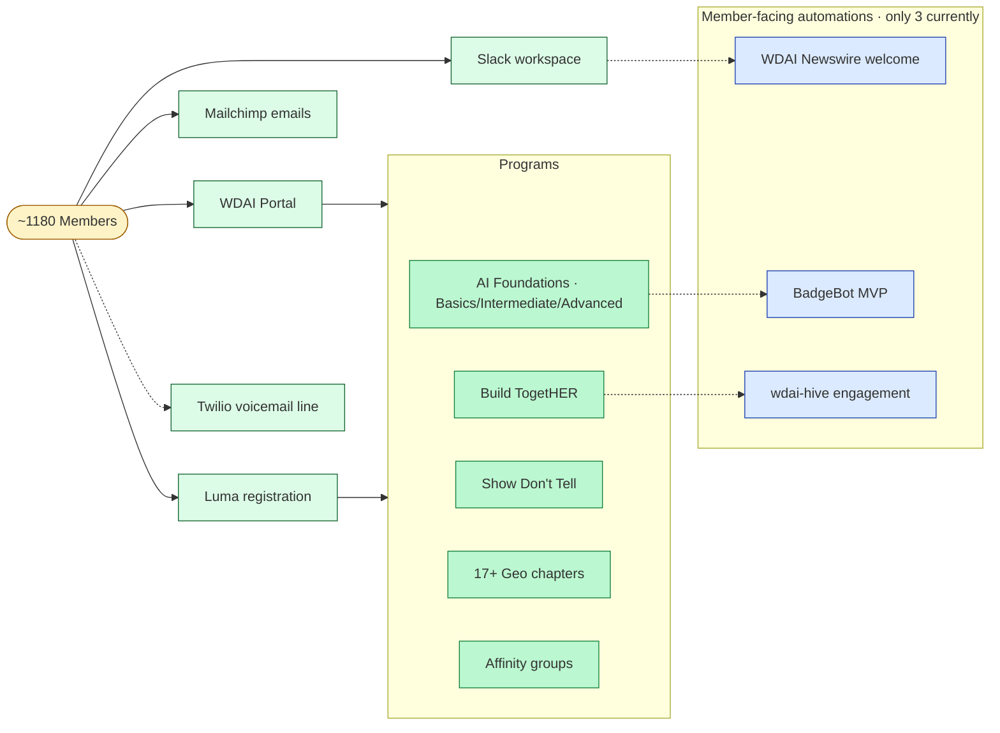

**Three takeaways anchored here:**

1. **Members have FIVE entry points, not one.** Portal, Slack workspace, Mailchimp emails, Luma registration, Twilio voicemail line. Programs are reached via Portal AND Luma (not Portal-only). Newswire posts are triggered by profile completion in Portal but the member sees them in Slack. Members never touch WDAI internal repos, agent stacks, or admin surfaces — but they touch MORE than one consumer-facing surface.

2. **Only THREE member-facing automations currently exist** — Newswire (welcome to community post on profile complete · platform-hosted Slack app · paradigm 4c), BadgeBot (MVP · cohort badges), wdai-hive (Build TogetHER weekly engagement DM · paradigm 2 Railway).

3. **Any Pass 3 federation lives upstream of this diagram.** The member surface is downstream of WDAI Operational Surface — the team-OS would produce programs; members consume them. Federation must not bleed into the member surface unless explicitly scoped to add a member-experience capability (which would inherit member-uptime expectations that paradigm 4 may not be able to meet — see SLA constraint in `03-operational-architecture.md`).

For the full inventory of member touch points (~30 surfaces — every API route, every Slack channel a member is in, every email cadence, every external integration), see `../deep-dive-member-surface.md`. The diagram above is the medium-resolution view; the deep-dive is the granular catalog; the C4 L1 in `01-system-context.md` is the single-arrow abstraction.

---

## Process flows (sequence diagrams)

How the system actually OPERATES — running flows that connect multiple containers.

### Member signup (Stripe checkout to first Slack post)

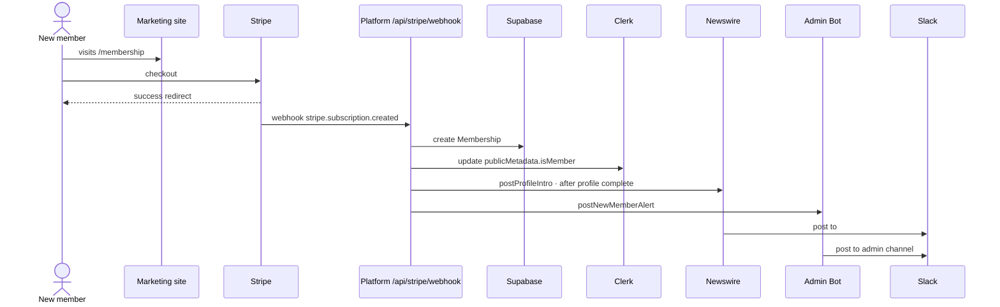

Shows the multi-system dance behind one signup. A Pass 3 federation would not insert into this flow unless the design adds member-related capability — out-of-scope by default.

### Cohort kickoff (mailchimp-cc skill invocation)

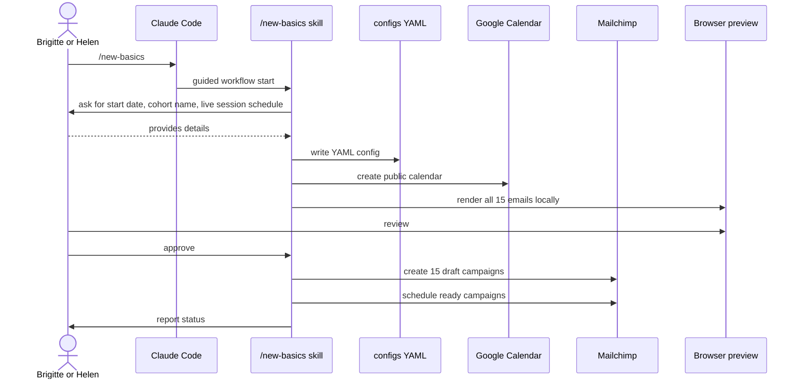

7-step guided workflow. Each step has safety gates (dry-run, confirmation, marker validation). This is the Q4 onboarding pattern in action.

### Marketing copy generation (wdai-marketing pipeline)

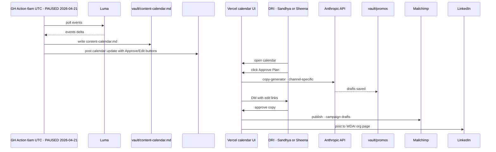

Currently runs by manual `workflow_dispatch` since 2026-04-21. Two-touchpoint approval (plan, then copy). All state in flat-file YAML in the repo.

---

## Member-side program journeys

The three sequences above are ops-facing. Members never see them. These are the journeys members actually experience — and they reveal which containers a Pass 3 federation would need to leave alone (member-facing) vs which it might safely instrument (ops-facing).

### AI Foundations cohort experience (15 lessons · 3 weeks)

The flagship program — ~80% of cohort load. Touches the most containers.

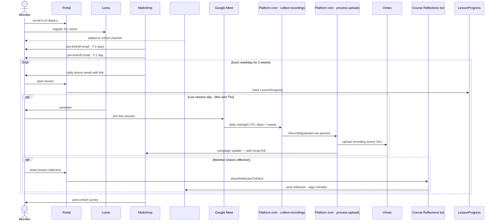

**What this reveals:** a single cohort touches **Portal + Luma + Mailchimp + Slack + Google Meet + platform's collect-recordings cron + process-uploads cron + Vimeo + Course Reflections (platform Slack app) + LessonProgress DB**. Nine containers per member per cohort, all platform-hosted on Vercel paradigm 4b. **Constraint surfaced for Pass 3:** any federation design must not insert into these — they're all member-facing and working today.

**Probe-verified 2026-05-12:** the Meet→Vimeo pipeline is **NOT** on Helen's Mac mini. It is `web/app/api/cron/collect-recordings/route.ts` (daily midnight UTC, three phases: Drain · Tracked · Sweep) + `web/app/api/cron/process-uploads/route.ts` (every 2hr odd hours). The "Wit" label that earlier Pass 1 drafts used for this pipeline was misattributed to an OpenClaw agent; the actual implementation is platform paradigm 4b. **No SPOF on Helen's hardware here** — the pipeline runs in Vercel even if Helen's Mac mini is off.

### course-update-agent monthly autonomous PR flow (Q2 reference)

**15th of the month** at 9am UTC (verified `cron: '0 9 15 * *'` in `course-content-agent.yml`). Companion `website-content-agent` runs on the **1st** at 9am UTC (`0 9 1 * *`). The canonical "agent proposes, human approves" loop running in production today.

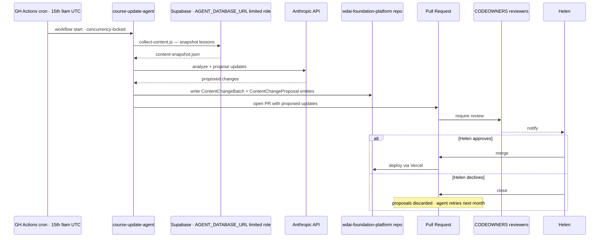

**What this reveals:** the autonomous agent has its OWN database connection (`AGENT_DATABASE_URL` — verified as a separate GH Actions secret in the workflow files). The name implies a scoped role; **actual DB privileges (read-only vs read-write, table-level grants) are not directly verified** — flagged in audit gaps. **The CODEOWNERS gate is the approval primitive.** PR review is non-optional. Two of these run monthly: **website-content-agent on the 1st, course-update-agent on the 15th** (probe-verified 2026-05-12 — earlier Pass 1 drafts had these reversed). Same shape, different content domain.

### Atlas → Polaris transcript pipeline (Q6 reference — working in Madina's stack)

How Madina's OpenClaw stack currently routes Granola transcripts AND enriches them with surrounding context. This is the per-user Granola consumption pattern Helen's design doc proposes scaling org-wide — but Atlas pulls more than just Granola to do it well.

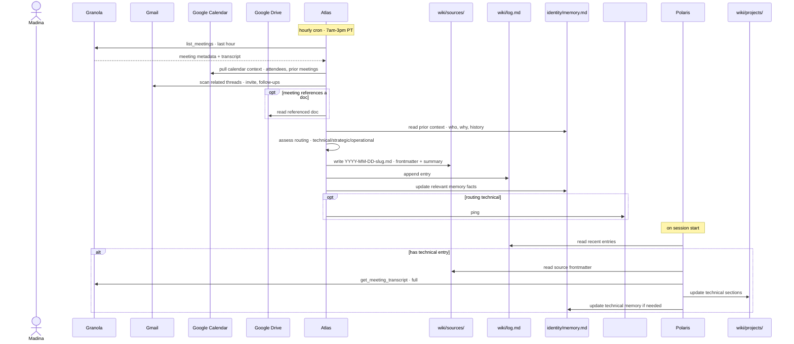

**What this reveals:** Atlas doesn't just route transcripts — it **enriches them** by pulling Calendar (who was there, what's the recurring context), Gmail (what threads led to this meeting, what follow-ups landed after), Drive (referenced docs), and Memory (who this person is, what we already know). The wiki entry is the OUTPUT of a multi-source synthesis, not just a transcript copy.

**Why this matters for Pass 3:** Helen's design doc proposes Granola → wiki as the pipeline. **Reality is richer.** A federation that ingests only Granola misses the Calendar/Gmail/Drive context that makes the wiki entry actually useful. Pass 3 must decide whether to:
- Federate Granola only (loses enrichment context)
- Federate Granola + enrichment sources (multiplies cross-account auth surface)
- Federate only the synthesized wiki output (sidesteps the per-user-account problem entirely)

**Constraint:** the pipeline is one-way (sources → wiki). No write-back into Granola/Gmail/Calendar/Drive. The wiki is the consolidation tier.

**The dedup problem when scaled:** Madina's Atlas reads Madina's Gmail+Cal+Drive+Granola. If Helen joins the team-OS, Helen's Syl reads Helen's Gmail+Cal+Drive+Granola. Two parallel synthesis pipelines for the same meeting produce overlapping but non-identical wiki entries. **This is the Q6 federation gap made concrete.**

### Member churn flow (surfaces the Wix → Stripe in-flight migration)

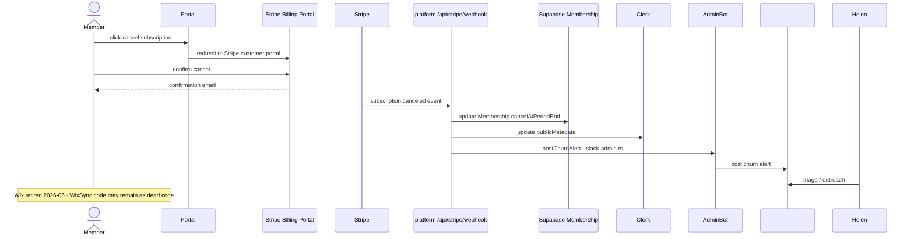

**What this reveals:** the Stripe-webhook → AdminBot flow is **paradigm 4c** (platform-hosted Slack app). Wix is retired as of 2026-05 (user-confirmed) — earlier "WixSync parallel-run until cutover" claim is stale. WixSync code in `wdai-admin` is now dead path until cleanup. **The Airtable → Supabase migration still pending and remains the Lumabot guest-approval hazard.**

### Schema migration via Expand-Contract (Q5 reference pattern)

Documented in `wdai-foundation-platform/CLAUDE.md` golden rule: *"Code can be reverted. Database migrations cannot."* The canonical safe-migration pattern.

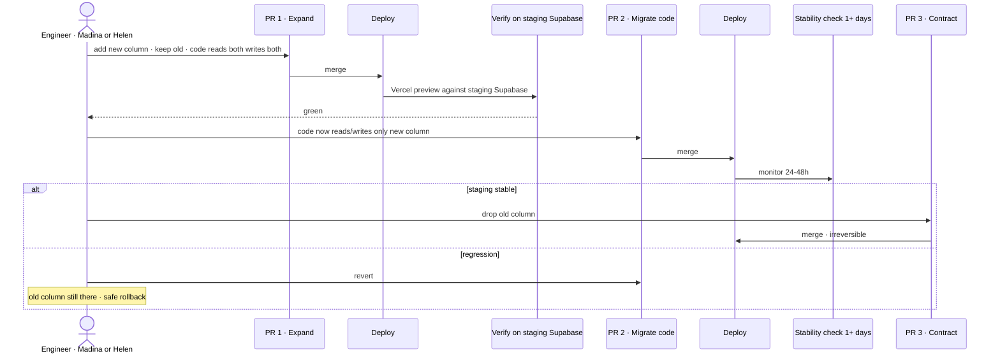

**What this reveals:** the platform team has a discipline for cross-repo migrations BUT the same discipline isn't enforced cross-repo. **The Airtable → Supabase migration affects Lumabot, which doesn't even have its own DB migration story** (lumabot deep-dive: no tests, no migrations directory). Expand-Contract works inside the platform; it doesn't extend to other repos that depend on shared external data sources.

### Helen's morning briefing (Syl + Gumloop · OpenClaw paradigm 1 in practice)

**Illustrative.** Helen has spoken about Syl + Gumloop in `#topic-openclaw`-style channels and her design doc; the specific cron time (6am PT), the dual-Gmail-address calendar read (`helen@womendefiningai.com` per platform `.env.local` + a personal Gmail inferred from her `helenlkupp` GitHub handle), and the exact sequence of API calls below are **inferred from her stated tool stack and not directly observed from her config files**. Helen committed her OpenClaw config files to a repo Apr 9 — verification would require reading that repo.

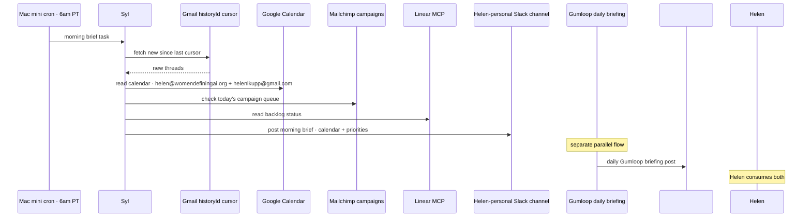

**What this reveals:** Helen runs **two parallel briefing systems** — Syl (OpenClaw on Mac mini) for personal/work synthesis, and a Gumloop briefing for `#team-agents` workspace context. **They don't share state.** Q1's runtime question is partly "do we collapse this into one or accept the two-runtime cost." The OpenClaw side is laptop-bound (Mac mini must be on); the Gumloop side is vendor-cloud (works regardless of Helen's machine).

### Generic event journey (Build TogetHER · Show Don't Tell · guest speakers)

Same shape across all monthly/ad-hoc events. The marketing pipeline drives announcement; the event runs through Luma + Google Meet + Wit; recap goes via Mailchimp.

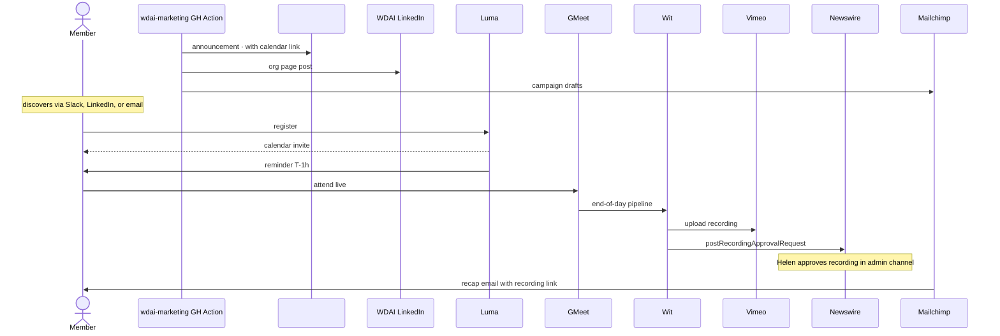

**What this reveals:** the same Wit/Vimeo/Newswire pipeline serves every event type. The marketing pipeline (currently paused cron, manual `workflow_dispatch`) is the entry point. **If the marketing cron stays paused, no events get auto-announced — they fall back to manual Slack posts.**

### Build TogetHER engagement loop (the wdai-hive layer)

Build TogetHER has a unique engagement primitive — the `wdai-hive` bot DMs members weekly "Did you play with AI this week?" and tracks responses. Different from other programs.

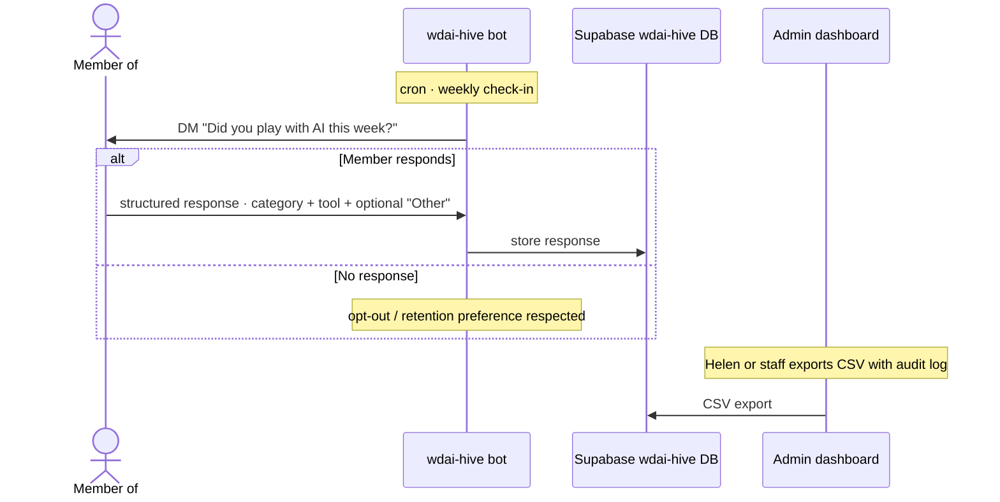

**What this reveals:** wdai-hive runs as its own paradigm-2 service (Railway-deployed per repo README) with its own Supabase tier. **It's the only program-level engagement-tracking instrument in WDAI.** AI Foundations and Show Don't Tell don't have equivalent loops — they rely on Mailchimp open/click data and Pattern's weekly metrics report.

### Cross-program member lifecycle (journey diagram)

**Illustrative.** A member's *typical* arc through WDAI programs over months. Emotion scores (1-5) are notional — they're not from member-survey data, they represent qualitative judgment of which stages feel rewarding vs friction-heavy. The container-coverage claim that follows is real; the emotional shape is hypothesis.

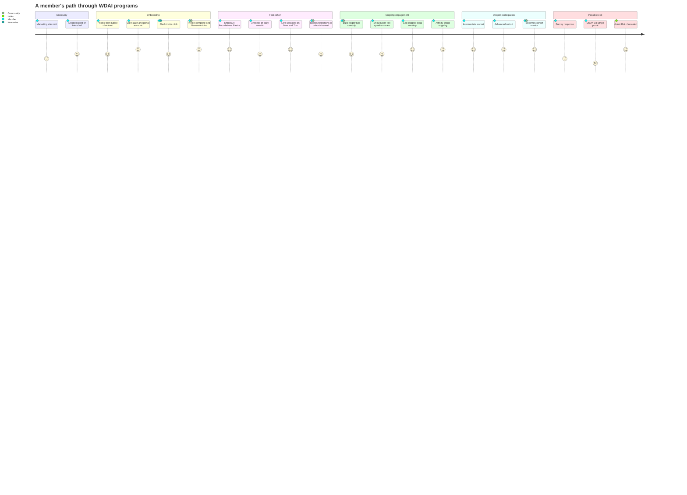

**What this reveals:** a member's journey spans **8+ container surfaces over 6+ months**. **Constraint surfaced for Pass 3:** any federation design must respect this arc — internal automations cannot interrupt or disrupt these member-facing touchpoints.

**Critical: there is no team-OS instrumentation at the journey level today.** Each container tracks its own metrics (Mailchimp opens, LessonProgress, EventRsvp, churn alerts). No view connects them into a per-member journey timeline. Pattern's weekly report aggregates but doesn't trace individual journeys.

---

## Programs-side ops journey (Lauren · Programs lead)

Lauren runs cohorts week-to-week. Her ops journey shows how a non-engineer leader currently navigates the system.

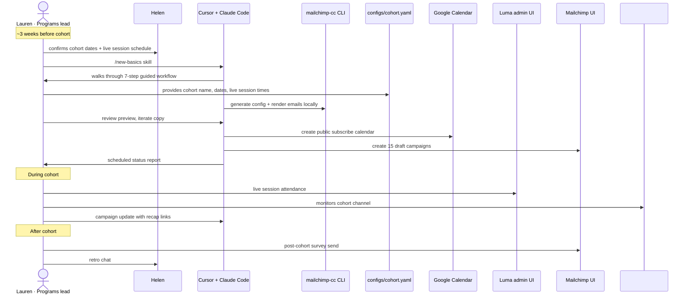

**What this reveals:** This diagram is an **illustrative ops journey** — Lauren is documented as Programs & Ops lead (wiki) and is the most likely owner of cohort kickoff, but whether she personally runs `/new-basics` end-to-end (vs Brigitte or Helen) is **not directly verified**. The cohort-kickoff sequence diagram above lists actor as "Brigitte or Helen" — the two diagrams haven't been reconciled against a single source of truth for who runs which step. The pattern itself (skill-driven, guided, browser-preview-before-commit) is real; the role attribution is inferred. If the `mailchimp-cc` tiered model does work for non-engineers, this is the kind of journey that would prove it.

If a Pass 3 onboarding plan can match this UX (guided slash-command workflow, preview before commit, browser+CLI mix), it will work for Sandhya / Sheena / Brigitte. If it requires writing TypeScript, it will not.

---
