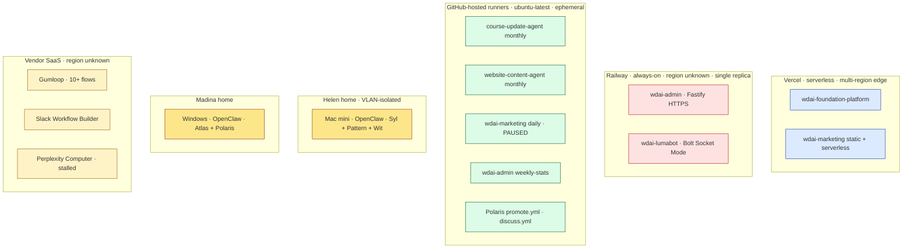
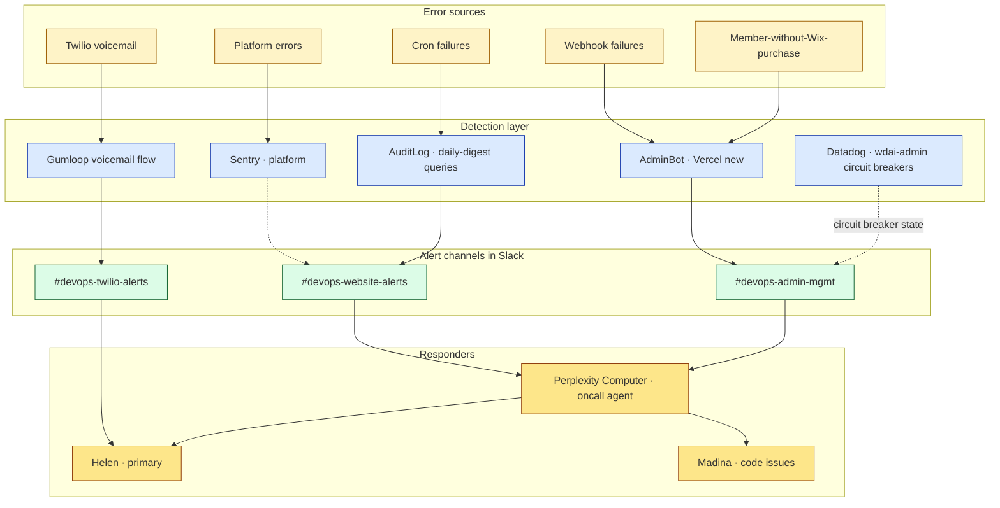

# Pass 1 · Operational architecture

**Part of the Pass 1 split.** See `01-system-context.md` for framing, the 7 Pass-3 design questions, and the C4 system overview. This file is one of the supplementary surfaces.

**Important framing:** "team-OS" throughout these documents refers to a **proposed future federation** that Pass 3 will design. It does not exist today. Phrasings like "Pass 3 must X" mean "X is a constraint surfaced by current state."

---

## Operational architecture

### Deployment topology (#14)

Where each container physically runs. Limited fidelity — regions/replicas not all confirmed.

**Knowns:** Vercel auto-edge-deploys, Railway is single-replica per service, GH Actions runners are ephemeral, Helen's Mac mini is on a VLAN (per Mar 8 `#topic-openclaw`), GitHub-hosted runners run `ubuntu-latest`.

**Unknowns (open questions):** Railway regions, Vercel deploy region pinning, Gumloop hosting region (GDPR-relevant), Madina's Windows network details, Perplexity Computer Space hosting region.

### SLA / criticality tiers (#11)

| Tier | Definition | Containers |
|------|------------|-----------|
| **T1** — must be up | Member-facing, money or auth path | `wdai-foundation-platform` (Webapp + Vercel crons), Stripe webhook handler, Clerk, Supabase, Slack workspace |
| **T2** — degraded OK | Internal automation, recoverable on next run | `wdai-admin` (draining), `wdai-lumabot`, `wdai-marketing` pipeline, `mailchimp-cc` CLI, AuditLog `daily-digest`, Pattern weekly report, Wit Meet→Vimeo |
| **T3** — can be down for days | Experimental, evaluation, or stalled | Perplexity Computer oncall agent (currently stalled), `claude-code-skills` reference repo, `weekly-wdai-report` GH Pages |

**Constraint surfaced for Pass 3:** if a federation is designed, it should not become a T1 dependency for member-facing flows — that would inherit member-uptime expectations a federation runtime may not be able to meet.

### On-call / incident response (#3)

**Current state:**
- **Sentry** monitors the platform (per `perplex_computer/space instruction.txt` read-only API credential list).
- **Datadog** is documented in `wdai-admin/README-MEMBERBOT.md` as a Railway deployment option for circuit-breaker metrics. **Whether it's actually enabled in production is feature-flagged** (`src/config/featureFlags.ts` references "if enabled") — treating as available-but-not-confirmed-live until verified.
- **AuditLog + `daily-digest`** is the platform's self-monitoring cron (8am UTC → `#devops-website-alerts`).
- **Perplexity Computer "oncall agent"** is the AI triage layer Helen built — read-only credentials across Stripe / Supabase / PostHog / Vercel / GitHub / Sentry. **Stalled since May 5** per the perplex_computer notes.
- **Helen is the primary human responder.** Madina handles code issues. No formal rotation.

**Inconsistency to flag:** `wdai-lumabot` deep-dive states *"No Sentry, no APM"* — that's specific to lumabot. Sentry IS in use for the platform. Updating the deep-dive separately.

**Open questions:**
- Is the Perplexity Computer oncall agent currently running or paused? (last touched May 5)
- What's the triage SLA — i.e., how long after an alert fires before Helen looks?
- Are Slack mentions used to escalate, or do channels just accumulate?

### External integration risk register (#6)

**Sourcing caveat:** scars below are drawn from Slack channel audits (`#ops-website`, `#team-core`, devops alert channels) and core-team conversations. Specific dates are **approximate** — not all directly cross-referenced to commits, PRs, or transcripts. The pattern (which externals have caused pain) is reliable; precise dates may drift.

| External | Documented scar | Frequency | Blast radius | Current mitigation |
|---|---|---|---|---|
| **Clerk** | Feb 19 cascade outage took platform down; Helen rolled back, decision to remove Clerk from public pages (Phase 3.3-3.5) | One major in 12 months | T1 — login broken | Phase 3.3-3.5 migration off public pages; in progress |
| **Supabase** | Feb multi-hour outage; staging↔local↔prod mismatch persistent through Jan-Feb | One major + ongoing dev-env pain | T1 — DB unreachable | Status banner system (Madina, mid-Feb); local/staging discipline being shored up |
| **Stripe** | Webhook complexity caused billing-cancel bugs (Feb 23) | Periodic | T1 — payment + cancellation paths | Mini retros + DB simplification; webhook error alerts pending |
| **Airtable** | Helen deleted `active memberships` view Jan 5 → prod lookup broken | One major + the 700-member migration debt | T2 — legacy lookup path | Migration to Supabase paused til Aug; Lumabot break flagged |
| **Luma** | Single-vendor dependency for event registration; auto-record + scheduling quirks (Mar 7 Helen on Luma migrations) | Periodic config issues | T1 — events flow | wdai-lumabot wraps it; no fallback |
| **Mailchimp** | Setup historically difficult — `mailchimp-cc` CLI exists precisely because the official UI is painful for cohort creation | One-time setup pain | T2 — campaign delivery | mailchimp-cc CLI + tiered contributor model |
| **Granola** | Helen's Business plan ended Apr 7; auto-foldering imperfect (Madina Apr 14 "too technical for granola, put it in SDLC folder") | Plan transition; periodic mis-fold | T2 — meeting capture | Per-user; need plan-status confirmation |
| **Vimeo** | Recording approval flow has Newswire post; Sheena's read.ai bot didn't record Apr 22 | Periodic | T2 — recap email delay | Wit pipeline + manual fallback |
| **Anthropic API** | Cost concentration across 5+ services + rate limits + OpenClaw token drain (Madina's earlier Windows-CMD issue) | Cost + occasional throttle | T2 — copy gen + agents | No unified rotation, no shared rate limit plan |
| **LinkedIn** | UGC API integration in wdai-marketing pipeline | Unknown | T3 — marketing channel | Auto-publish via marketing repo Phase 6 |
| **Google Workspace** | Nonprofit plan; .org accounts can't record Google Meet (PR #502 workaround) | Plan limitation | T2 — recording capture | Workaround in place |
| **Wix** | **RETIRED 2026-05** per user confirmation. Earlier docs claimed parallel-running until August; that's stale. WixSync code may remain in `wdai-admin` until cleanup. | One-time migration (completed) | T3 — historical | Audit `wdai-admin` for residual WixSync code paths |

---
