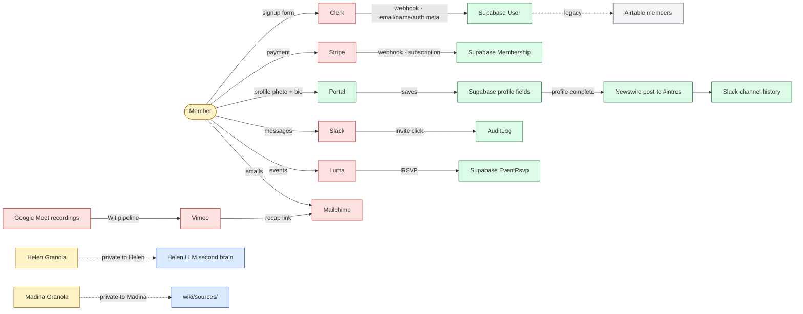
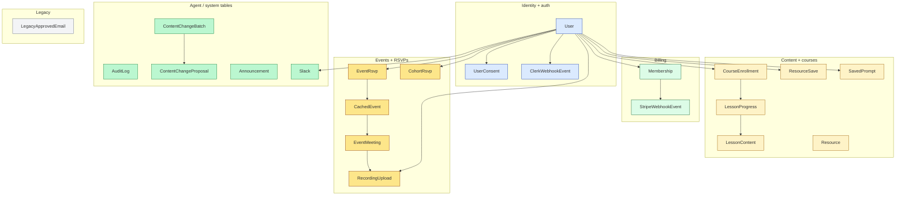

# Pass 1 · Data architecture

**Part of the Pass 1 split.** See `01-system-context.md` for framing, the 7 Pass-3 design questions, and the C4 system overview. This file is one of the supplementary surfaces.

**Important framing:** "team-OS" throughout these documents refers to a **proposed future federation** that Pass 3 will design. It does not exist today. Phrasings like "Pass 3 must X" mean "X is a constraint surfaced by current state."

---

## Data architecture

### Data flow / data residency (#2)

Where member PII flows. Honest about what I don't know.

**Member PII lives in at least 8 systems** (Stripe, Clerk, Supabase, Mailchimp, Slack, Luma, Vimeo, Airtable). Plus per-user Granola transcripts that may include member voices on cohort calls.

**GDPR exposure (rough):**
- UK chapter members exist (`geo-london`, `uk-hackathon-*` channels)
- Right-to-delete would have to touch all 8 systems
- No documented retention policy for any of them (open question)

**Knowns about retention:**
- AuditLog: indefinite (no purge job visible)
- Mailchimp: kept until manually unsubscribed
- Supabase: indefinite
- Slack: workspace retention setting (unknown — probably default)

**Unknowns (open questions):**
- Mailchimp retention policy
- Granola retention (per-account)
- Vimeo retention for cohort recordings
- LinkedIn-side data (WDAI org page posts)
- Stripe retention (legally bounded for PCI but specifics not documented)
- Recording consent flow — do members opt in to Vimeo upload?

### Data model — Prisma entity relationships (#12)

22 entities in `wdai-foundation-platform/web/prisma/schema.prisma`. Names known; full FK relationships not 100% verified from the audit (would need a schema dump). Inferred groupings:

**Inferred — needs schema verification.** I read the entity *names* in deep-dive prep; the explicit relationships (FK names, cascade rules, indexes) require reading the schema file. Flagged as open question.

**What this surfaces:** `User` is the hub. Six concerns radiate from it. Pass 3 must respect this if any federation design ever touches member records — and per the out-of-scope boundary, it shouldn't.

---
