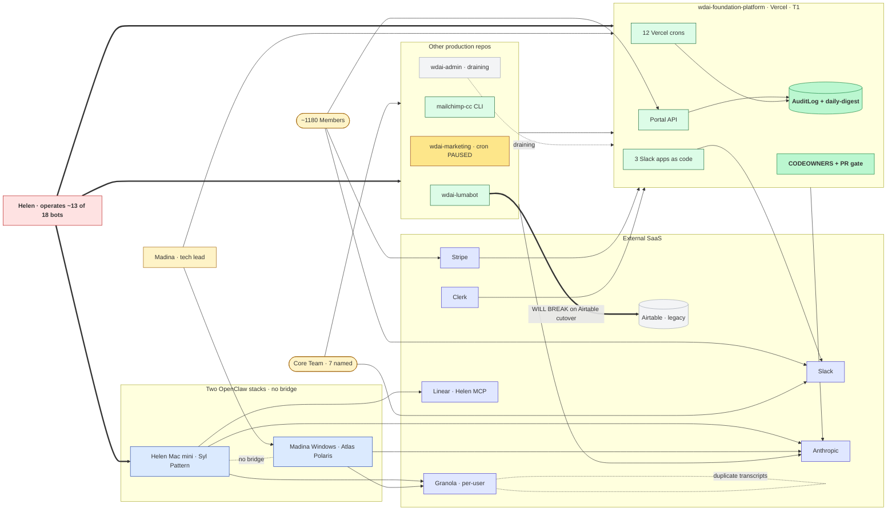

# Pass 1 · One-page system summary

**Five-minute read.** What WDAI's operational system looks like today, condensed.

This is a SUMMARY — every claim below is sourced in one of the Pass 1 siblings (`01-system-context.md` through `05-people-and-process.md`) or one of the deep-dives in `../`. Read `_pressure-test.md` before treating any specific claim as ground truth.

---

## The system in one diagram

**Read it like this:** Green-bold = federation primitives that already work (`AuditLog` + `CODEOWNERS`). Bold-red = the bottleneck human. Amber = production but unstable (marketing cron paused). Blue = the two OpenClaw stacks that don't talk to each other. The `WILL BREAK` edge is the most concrete cross-repo hazard. The `duplicate transcripts` loop on Granola is the per-user Q6 problem.

---

## What WDAI is, operationally

A 1180-member nonprofit running on **15 GitHub repos, 6 execution paradigms, 26 observable findings**, with **one bottleneck human (Helen) personally operating ~13 of 18 named bots** and **two parallel unfederated AI agent stacks** (Helen's Mac mini · Madina's Windows).

There is no "team-OS" today. Pass 3 is the design exercise that may create one.

---

## The boundary

**Inside the boundary:** 5 production repos · 2 OpenClaw stacks · 4 SaaS layers (Gumloop, Slack Workflow Builder, GitHub Actions, Linear) · 2 data stores (Supabase, Airtable).

**Persons crossing the boundary:**
- ~1180 Members (Clerk auth)
- Volunteers (Drive + Slack)
- 5 named Core team (Helen · Madina · Brigitte · Lauren · Sandhya · Sheena · Rita) — Helen and Madina hold all agent setups
- 2 personal AI agent stacks

**Externals (14):** Slack · Mailchimp · Luma · Vimeo · Google Meet · Google Drive · Clerk · Stripe · LinkedIn · Anthropic · Linear (contested) · Granola (contested) · Airtable (legacy) · Wix (legacy)

---

## The seven Pass-3 questions Pass 1 surfaces

| # | Question | Evidence Pass 1 produced |
|---|----------|--------------------------|
| Q1 | Where does the team-OS live? | 6 paradigms in flight; P4 (cloud cron) is the federation sweet spot; P1 (OpenClaw) is mature but unfederated |
| Q2 | How do agents propose, humans approve? | `course-update-agent` + `website-content-agent` + marketing `/approve-plan` already ship the pattern |
| Q3 | How do we observe what's running? | `AuditLog` + `daily-digest` is the existing self-monitoring primitive |
| Q4 | How do we onboard non-engineers? | Sheena is zero-state today; `mailchimp-cc` tiered model (runbooks → skills → source) is the reference |
| Q5 | How do we coordinate cross-repo migrations? | Airtable → Supabase will break Lumabot's guest approval unless coordinated |
| Q6 | How do we ingest per-user Granola → shared wiki? | Each Granola account is private; multi-attendee meetings produce duplicate transcripts |
| Q7 | How does identity/auth federate? | CODEOWNERS only in platform; three Slack tokens; Gumloop is single-user internally anonymous |

---

## The shape

**Five production containers, three runtimes:**

| Container | Runtime | Role | Tier |
|-----------|---------|------|------|
| `wdai-foundation-platform` | Vercel | Portal, member API, 12 Vercel crons, 3 Slack apps as code | T1 — must be up |
| `wdai-marketing` | Vercel + GH Actions | Marketing copy pipeline, content calendar | T2 |
| `mailchimp-cc` | npm CLI (local) | Cohort kickoff skill (Brigitte / Helen / Lauren) | T2 |
| `wdai-admin` | Railway | Draining into platform | T2 — draining |
| `wdai-lumabot` | Railway | Luma guest sync, Slack Bolt | T2 |

**Two OpenClaw stacks, no bridge:**
- Helen's Mac mini: Syl + Pattern (the previously-listed "Wit" is the platform's collect-recordings cron, not an OpenClaw agent — probe-verified 2026-05-12)
- Madina's Windows: Atlas + Polaris (shared wiki + memory between them)
- No peer messaging or shared state between the two machines

**Two monthly autonomous code-modifying agents** inside the platform (`website-content-agent` 1st of month, `course-update-agent` 15th — probe-verified 2026-05-12) — they open PRs gated by `CODEOWNERS`. This is the proven Q2 propose/approve pattern.

---

## The critical hazards

1. **Single-owner concentration.** Helen operates ~13 of 18 bots. Bus-factor risk is structural.
2. **Lumabot ⟂ Airtable cutover.** Lumabot silently reads Airtable as source-of-truth. The platform's Airtable → Supabase migration (paused until August) will break Lumabot's guest approval if not coordinated. Cross-repo dependency that neither repo's CLAUDE.md flags.
3. **No federation between OpenClaw stacks.** Helen's stack and Madina's stack both reach the platform but cannot talk to each other. Granola transcripts of shared meetings are duplicated, not deduplicated.
4. **Paradigm-2 services (Railway) draining into paradigm 4 (Vercel + cloud cron).** AdminBot mid-migration; Lumabot may follow. Pass 3 must not bet on Railway.
5. **Marketing daily cron PAUSED since 2026-04-21.** Reason not yet diagnosed.

---

## The federation primitives that already work

- **`AuditLog` + `daily-digest`** — self-monitoring cron. Pass 3 should reuse, not rebuild.
- **`CODEOWNERS` + PR gate** — only in `wdai-foundation-platform` but proven for agent-proposed code changes.
- **`x-admin-secret` HTTP header pattern** — cross-paradigm primitive shared by `wdai-admin/weekly-stats.yml`, Atlas's `promote.yml`, Polaris's `discuss.yml`.
- **`wdai-marketing` vault structure** — pillar-level federation prototype (vault/ context + skills/ + promos/ + status/).
- **`mailchimp-cc` tiered contributor model** — runbooks → skills → source code, the Q4 reference.

---

## What Pass 1 deliberately does not answer

- Which runtime should host the federation? (Q1, Pass 3's call)
- Should Granola be deduplicated at the per-user level or at the wiki-write level? (Q6)
- Should `CODEOWNERS` generalize org-wide or stay platform-only? (Q7)
- What's the onboarding ladder for Sheena specifically? (Q4)
- How does a cross-repo migration coordinate Airtable retirement without breaking Lumabot? (Q5)

These are Pass 3's job. Pass 1 only frames them.

---

## Where to go next

1. **`_pressure-test.md`** — every Tier C (inferred) and Tier D (fabricated/scrubbed) claim is logged here.
2. **`01-system-context.md`** — C4 L1/L2/L3 + cross-cutting structural views.
3. **`02-process-flows.md`** — 13 sequence diagrams + 1 journey + 1 ops journey.
4. **`03-operational-architecture.md`** — deployment topology, SLA tiers, external risk register.
5. **`04-data-architecture.md`** — data flow + Prisma ER (22 verified entities).
6. **`05-people-and-process.md`** — persona tooling map + stakeholder INFERRED PROFILES.
7. **Companion deep-dives in `../`** — per-repo and per-surface granular catalogs.

---

**Source of truth for any Pass 1 claim:** check the sibling file first, then the deep-dive it cites, then the actual repo file path. If a claim doesn't cite a source you can open, it's inference — apply skepticism.
