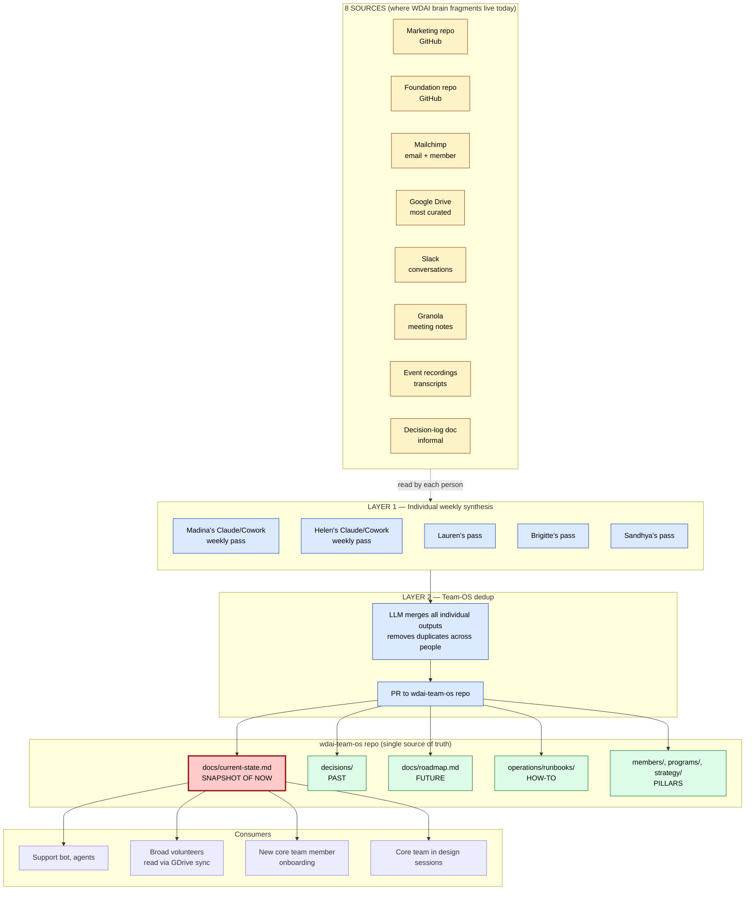
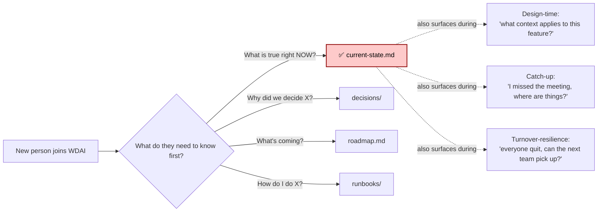

# Why `current-state.md` exists

> Anchor doc — explains the purpose of `current-state.md` within the team-OS federated KB.
> Source of truth for the architecture: `memory/project_team_os_one_brain.md` (per Madina↔Helen 1:1, 2026-05-11).
> Pass: 2 (pass-1 in `pass-1/` not overwritten).

## The pain in one sentence

WDAI's knowledge is scattered across 8+ sources; **no single artifact answers the question "what is true right now at WDAI?"** — so onboarding, turnover, and cross-pillar design all start from "ask Helen."

## What `current-state.md` is

A **snapshot of NOW** — the deduped output of the team-OS federated sync, scoped to *present-tense state* (who's on the team, what's running, what's broken, what the org's running on). Not history, not future, not how-to. A reader should be able to open it and within 5 minutes know: who, what's live, what's blocked.

## What it is NOT (sibling artifacts in `wdai-team-os/`)

| Artifact | Tense | Answers |
|---|---|---|
| `decisions/` (ADRs) | Past | "Why did we choose X?" |
| `docs/roadmap.md` | Future | "What's next?" |
| `operations/runbooks/` | Imperative | "How do I do X?" |
| **`docs/current-state.md`** | **Present** | **"What is true right now?"** |
| `members/`, `programs/`, `strategy/` | Pillar-specific reference | Domain-deep, not org-wide |

Without `current-state.md`, the present-tense layer is missing and readers reconstruct it by reading everything else.

## How it gets populated (the federated sync, simplified)

## Why current-state.md specifically (vs the other sibling docs)

## The three value props this serves (Madina, 2026-05-20)

1. **Catch-up** — missed meeting? `current-state.md` lets you re-orient without asking who-knows-the-context
2. **Design-time surfacing** — building a new feature? `current-state.md` tells you what existing pieces apply before you start
3. **Turnover-resilience** — full team rotation? `current-state.md` is the snapshot that survives the people leaving

## What goes in vs what doesn't

| Goes in `current-state.md` | Goes elsewhere |
|---|---|
| Active members count (right now) | Member growth history → analytics/dashboard |
| Live programs + cohort dates | Why we chose cohort model → ADR |
| Vendor stack (who's hosting what) | How to deploy → runbook |
| Open hiring needs | Why we need a hire → roadmap |
| Known broken things | How to fix them → runbook |
| Current admin access map (C4) | Migration runbook for transferring access → runbook |
| Team org chart | Personal operating manuals → members/ pillar |

If a fact is **time-stable for > 6 months**, it belongs in a pillar, not current-state. If it's time-stable for < 6 weeks, it shouldn't be in any markdown — it's runtime state and should be queried live.

## How it stays accurate (triggers — high level only)

Per `project_team_os_one_brain`:

- **Layer 1 trigger:** weekly cadence per person + ad-hoc on major decisions
- **Layer 2 trigger:** bi-weekly dedup pass + ad-hoc on major source-of-truth change
- **Runtime decision:** deferred to its own ADR (same decision as Beacon runtime — collapse into one)

Do NOT propose source-pull triggers (Linear cron → current-state.md, Mailchimp webhook → current-state.md). That's wrong-altitude per `feedback_team_os_wrong_altitude.md`.

## Anti-patterns to reject

1. **Stuffing everything into current-state.md** — it becomes a 10k-line junk drawer. If it's history, runbook, or future — it belongs elsewhere.
2. **Source-pull cron → current-state.md** — wrong altitude; current-state is one sibling, not the destination.
3. **Manual edit without going through Layer 1/2** — drifts from source; the federated sync IS how truth gets into the repo.
4. **Treating current-state.md as a roadmap** — roadmap is forward; current-state is present.

## Open questions (decide before scaling)

1. **Granularity:** does current-state.md split into per-pillar files (member-state, program-state, infra-state) or stay one consolidated doc? Pass-1 tried the consolidated route; revisit when content grows past 500 lines.
2. **Volunteer read path:** how do broad volunteers read this without GitHub literacy? GDrive mirror? Read-only portal page? Beacon `/team-os` slash command?
3. **Layer 2 runtime:** what powers the bi-weekly dedup? Same decision as Beacon runtime — defer to runtime ADR, but flag that current-state's accuracy depends on it.

## What this doc is NOT

- Not a spec for the federated sync (that's `project_team_os_one_brain`)
- Not a roadmap for the team-OS build (that's `wdai-team-os/docs/roadmap.md`)
- Not a runbook for editing current-state (that comes when we build the `team-os-sync` skill)
- Just answers: *why does this single artifact exist, what's its scope, what's its sibling distinction*

## Connected

- `memory/project_team_os_one_brain.md` — full architecture
- `memory/feedback_team_os_wrong_altitude.md` — anti-patterns
- `wdai-team-os/docs/current-state.md` — the doc itself
- `wdai-team-os/docs/roadmap.md` — C-series turnover-resilience gaps drive content backfill
- Pass-1 attempt in `pass-1/` — kept for historical reference, NOT overwritten
